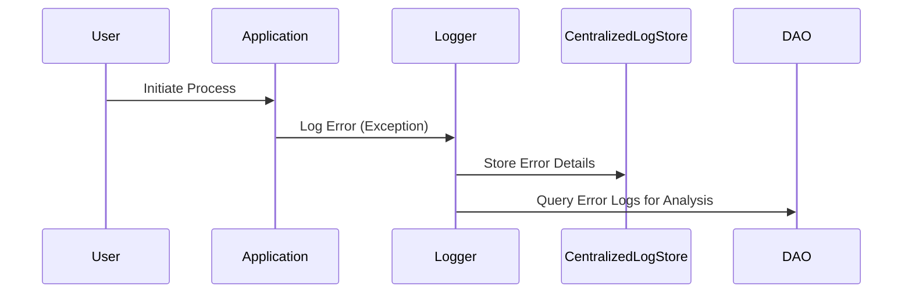

Error Logging design pattern involves systematically recording detailed information about errors that occur within a system. This pattern is essential in modern software architectures, providing visibility into system operations, facilitating troubleshooting, and enhancing decision-making capabilities for developers and system administrators. This pattern is particularly important in distributed systems and microservices architectures, where failures can originate from various components and sources.

## Detailed Explanation

### Purpose

The primary goal of the Error Logging pattern is to capture sufficient error details to understand and rectify issues without significantly disrupting the user experience. This includes error types, stack traces, context information, timestamps, user environment, and any other relevant data.

### Architectural Approaches

1. **Centralized Logging System**: This approach involves aggregating logs from various components into a centralized system such as Elasticsearch, Logstash, Kibana (ELK Stack), or cloud-native solutions like AWS CloudWatch or Google Cloud Logging. Centralized systems facilitate powerful querying and visualization capabilities.

2. **Structured Logging**: Structured logging implies capturing logs in a structured format (e.g., JSON) to enable easier parsing and querying. This is beneficial in maintaining consistency across different log data sources.

3. **Real-time Monitoring and Alerting**: Integrating real-time alerting mechanisms like Prometheus or Grafana can enable immediate notification about critical errors, helping in quick response.

### Example Code

Here is a simple implementation in Java using SLF4J (Simple Logging Facade for Java) and Logback:

```java
import org.slf4j.Logger;
import org.slf4j.LoggerFactory;

public class ErrorLogger {
    private static final Logger logger = LoggerFactory.getLogger(ErrorLogger.class);

    public static void handleError(Exception e) {
        logger.error("Exception encountered: ", e);
    }

    public static void main(String[] args) {
        try {
            throw new RuntimeException("Test Exception");
        } catch (Exception e) {
            handleError(e);
        }
    }
}
```

### Diagrams

#### Sequence Diagram (Error Logging Flow)



### Related Patterns

- **Retry Pattern**: Aimed at error recovery by retrying failed operations after certain conditions.
- **Circuit Breaker Pattern**: Protects from repeated and persistent errors in an unstable service.
- **Bulkhead Pattern**: Isolate different system components to ensure that errors in one area do not propagate to others.

### Best Practices

- **Detailed Context**: Ensure logs contain enough contextual information without overwhelming the storage.
- **Log Levels**: Use appropriate log levels (e.g., DEBUG, ERROR, INFO) to balance between detail and performance.
- **Retention Policies**: Implement log retention policies to manage storage costs and comply with regulations.

### Additional Resources

- [Logging Best Practices](https://example.com/logging-best-practices)
- [Centralized Logging in AWS](https://example.com/aws-centralized-logging)
- [Structured Logging](https://example.com/structured-logging)

## Summary

The Error Logging design pattern plays a crucial role in the effective operation and maintenance of cloud-based, scaled systems. It empowers developers and system administrators by providing insights into the live state of applications, diagnosing issues quickly, and making informed decisions based on comprehensive log data. Proper implementation of this pattern enhances system reliability, user satisfaction, and overall software quality.
