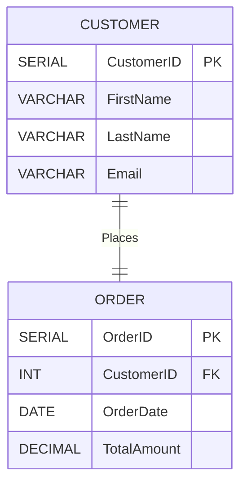

## Description

The Surrogate Key Pattern is a database design strategy that involves using a system-generated unique identifier (called a surrogate key) as the primary key in a table, rather than a natural key, which is a meaningful and unique attribute from the dataset, such as an email address or social security number. Surrogate keys are artificial and have no business meaning but provide significant advantages in terms of performance, consistency, and simplicity in relational database systems.

## Architectural Approach

1. **Key Generation**: Surrogate keys are typically generated automatically by the database system. Common strategies include using auto-incrementing integers, UUIDs, or GUIDs.

2. **Consistency and Uniqueness**: Surrogate keys ensure uniqueness across the rows of the table without relying on user-provided data, thereby reducing the chances of human errors and duplication.

3. **Decoupling from Business Logic**: By not using business-specific attributes as keys, changes in business rules do not affect the primary key structure, allowing for flexible database schema evolution.

4. **Performance Optimization**: Surrogate keys, being of uniform data type and size, promote indexing efficiency and speed up joins and lookups.

## Best Practices

- **Avoid Overuse**: Use surrogate keys for large tables and where the natural key is composite, large, or changes frequently. Do not use surrogate keys unnecessarily for small datasets.
  
- **Compatibility**: Ensure that surrogate keys are compatible with other systems for interoperability, especially if they rely on specific ID formats.

- **Referential Integrity**: Maintain referential integrity via foreign keys that reference the surrogate keys in parent tables.

## Example Code

Consider a customer table where a surrogate key is used as the primary key:

```sql
CREATE TABLE Customers (
    CustomerID SERIAL PRIMARY KEY,
    FirstName VARCHAR(50),
    LastName VARCHAR(50),
    Email VARCHAR(100) UNIQUE
);
```
Here, `CustomerID` is a surrogate key with auto-incremented values. `Email` remains a candidate for uniqueness but not its primary key.

## Diagrams

Below is a simple entity-relationship diagram (ERD) highlighting the use of surrogate keys:



## Related Patterns

- **Natural Key Pattern**: Using domain-specific attributes as primary keys.
  
- **Composite Key Pattern**: Combining multiple fields to serve as a primary key.

- **UUID Key Pattern**: Utilizing Universally Unique Identifiers as a method of generating surrogate keys.

## Additional Resources

- *Database Management Systems* by Raghu Ramakrishnan and Johannes Gehrke
- [Oracle Documentation on Primary Keys](https://docs.oracle.com/en/database/)
- [PostgreSQL Serial Column Documentation](https://www.postgresql.org/docs/current/datatype-numeric.html#DATATYPE-SERIAL)

## Summary

The Surrogate Key Pattern is a fundamental design choice in relational database modeling that focuses on using system-generated keys for the representation of table rows. This pattern aids database optimization by ensuring keys are independent of mutable business data, thereby improving flexibility, integrity, and performance.
