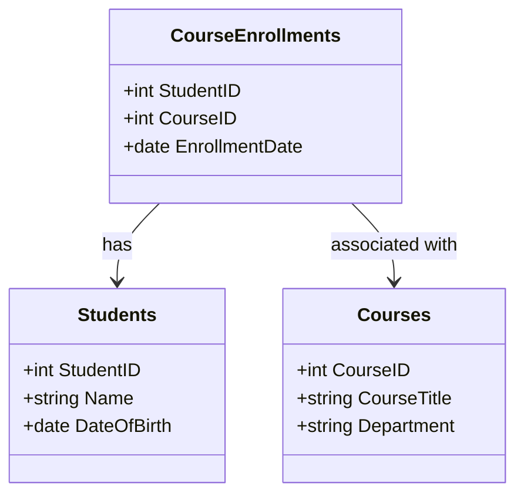

## Composite Key Pattern

### Description

The Composite Key Pattern is used in relational databases when it's necessary to uniquely identify a record using more than one column. This pattern is instrumental in enforcing uniqueness and maintaining referential integrity across relationships without introducing additional surrogate keys. By combining multiple columns to form a primary key, the pattern naturally reflects complex real-world relationships.

### Architectural Approaches

1. **Multi-Column Primary Keys**: Utilizes the inherent ability of relational databases to composite multiple columns into a single logical primary key. This approach is useful when existing data fields, such as `StudentID` and `CourseID`, provide a natural composite to form a unique key.
   
2. **Natural Relationships**: Leverages naturally occurring composite keys to avoid unnecessary use of surrogate keys. This is particularly effective in situations where the composite nature directly maps to real-world identifiers.
  
3. **Dimensional Modeling**: In dimensional models, composite keys can be used in bridge tables or to handle many-to-many relationships.

### Best Practices

- **Avoid Unnecessary Surrogates**: Where natural composite keys exist, prefer them over surrogate keys for maintaining meaningful database relationships.
- **Indexing**: Properly index composite keys to optimize query performance.
- **Consistency**: Ensure all primary and foreign key constraints are consistently applied across related tables.
- **Normalization**: Maintain structural integrity and normalize tables adequately when using composite keys.

### Example Code

Below is an example SQL snippet demonstrating the Composite Key Pattern in a `CourseEnrollments` table using `(StudentID, CourseID)` as the primary key:

```sql
CREATE TABLE CourseEnrollments (
    StudentID INT NOT NULL,
    CourseID INT NOT NULL,
    EnrollmentDate DATE,
    PRIMARY KEY (StudentID, CourseID),
    FOREIGN KEY (StudentID) REFERENCES Students(StudentID),
    FOREIGN KEY (CourseID) REFERENCES Courses(CourseID)
);
```

### Mermaid UML Class Diagram



### Related Patterns

- **Surrogate Key Pattern**: Uses an artificial primary key for scenarios where a single column key is needed, and natural keys are not feasible.
- **Foreign Key Pattern**: Achieved by defining columns in a child table that reference composite keys of the parent table.
- **Candidate Key Pattern**: Ensures there are alternate keys in case the main composite key becomes impractical.

### Additional Resources

- [Relational Database Design W3Schools](https://www.w3schools.com/sql/sql_primarykey.asp)
- [Database Design - Composite Key in SQL & NoSQL](https://www.geeksforgeeks.org/sql-composite-key-introduction/)
- [Understanding Composite Keys](https://www.techopedia.com/definition/656/composite-key)

### Summary

The Composite Key Pattern is essential for modeling complex real-world relationships in relational databases that cannot be adequately represented by a single column key. It primarily helps maintain referential integrity and ensures uniqueness without needing surrogate indicators, provided the columns naturally combine to ensure a unique record identity within the table. Proper use enhances performance and data integrity in both OLTP and OLAP environments.
