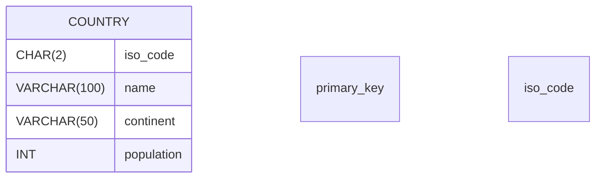

## Natural Key Pattern

### Description
The Natural Key Pattern involves using business-relevant attributes that inherently carry meaning as primary keys in a relational database. Unlike surrogate keys, which are artificially created identifiers, natural keys are derived from the data itself. This approach enhances the readability and intuitiveness of database schemas by embedding business logic directly into the table structure.

### Architectural Approach

1. **Identification of Attributes**: Determine which attributes naturally define unique entities within a dataset, such as Social Security numbers for individuals or ISBNs for books.
   
2. **Business Logic Alignment**: Ensure the keys align with business processes, making database interactions more intuitive.

3. **Stability**: Choose natural keys that are less likely to change over time to avoid the need for cascading updates across foreign key relationships.

4. **Index and Constraint Definition**: Natural keys can efficiently serve as primary keys and should be thoroughly indexed to optimize query performance.

### Example Code

Consider a scenario where we manage a database of countries:

```sql
-- Countries table using a natural key
CREATE TABLE Countries (
    iso_code CHAR(2) PRIMARY KEY,
    name VARCHAR(100) NOT NULL,
    continent VARCHAR(50),
    population INT
);

-- Query using the natural key
SELECT * FROM Countries WHERE iso_code = 'US';
```

### Best Practices

- **Natural Key Longevity**: Select keys that reflect stable business data.
- **Clarity and Usability**: Utilize keys that provide immediate context and meaning.
- **Integration with Business Logic**: Ensure keys are easily understood by domain experts.

### Related Patterns

- **Surrogate Key Pattern**: Opposes the natural key by using artificial, system-generated identifiers.
- **Composite Key Pattern**: Uses a combination of multiple attributes as the key, which can sometimes reflect a more complex natural key scenario.

### Diagrams



### Additional Resources

- [Database Design for Mere Mortals](https://www.oreilly.com/library/view/database-design-for/9780133824854/)
- [SQL and Relational Theory](https://www.oreilly.com/library/view/sql-and-relational/9781449319724/)
- [Introduction to Database Systems](https://smile.amazon.com/Introduction-Database-Systems-C-J-Date/dp/0321197844)

### Summary

The Natural Key Pattern promotes the use of intrinsic, business-meaningful data points as primary keys, thereby aligning database structures more closely with real-world entities and processes. While potentially leading to complexity with changing or composite data points, when chosen carefully, this pattern results in more understandable and robust databases. Considerations of stability and the potential need for cascading update routines are key to effectively implementing natural keys in relational databases.
