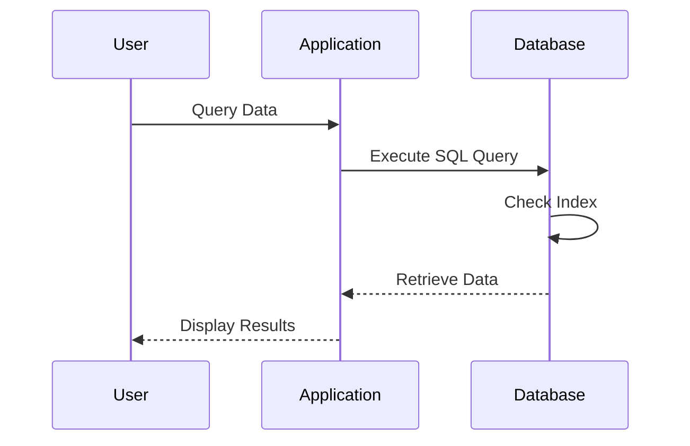

## Indexing Strategies

### Overview

Indexing in relational databases is a critical component for optimizing query performance. The primary purpose of an index is to enhance the speed of data retrieval operations on a database table at the cost of additional writes and storage space. Effective indexing strategies involve creating indexes based on how data is most frequently accessed through different types of queries.

### Key Concepts

- **Index**: A database object that improves the speed of data retrieval. It is similar to the index of a book, which helps in quickly locating the pages of interest.
- **Clustered Index**: Reorders the physical storage of data. A table can have only one clustered index if required.
- **Non-Clustered Index**: Doesn't alter the data storage; rather, it creates a separate object within the table with pointers back to the original data rows.
- **Composite Index**: An index on two or more columns of a table. Useful for queries that filter on multiple columns.

### Architectural Approaches

1. **Single-Column Indexing**: Indexes are created on individual columns, often the columns used in the `WHERE` clause.
  
2. **Composite Indexing**: Used when queries commonly filter, sort, or group by multiple columns. 

3. **Covering Indexes**: A form of composite index that includes all the columns required by a query, reducing disk I/O by avoiding accessing the actual table data when retrieving results.

4. **Full-Text Indexes**: Designed for searching textual data, optimizing queries with search terms using natural language.

5. **Filtered Indexes**: Indexes that contain a subset of table data. They improve performance by indexing only the rows of interest.

### Implementation Example

```sql
-- Create a single-column index on the LastName column
CREATE INDEX idx_employees_lastname ON Employees (LastName);

-- Create a composite index on the FirstName and LastName columns
CREATE INDEX idx_employees_fullname ON Employees (FirstName, LastName);

-- Create a filtered index for only active employees
CREATE INDEX idx_active_employees ON Employees (DepartmentId) WHERE Active = 1;
```

### Diagrams

#### Sequence Diagram of Index Lookup



### Related Patterns

- **Denormalization Patterns**: To reduce the number of joins by embedding related data.
- **Partitioning Patterns**: Distributing rows of a table across partitions based on key column values for improved performance.

### Additional Resources

- "Database System Concepts" by Silberschatz, Korth, and Sudarshan offers a foundational understanding of databases including indexing principles.
- "SQL Performance Explained" by Markus Winand discusses in detail how various indexing strategies impact performance.
- [Database Design Best Practices](https://www.databasedesign.com) – A practical guide to database design which includes sections on optimizing indexes.

### Summary

Indexing strategies in relational databases are paramount for enhancing query performance. While adding indexes comes with trade-offs in terms of write performance and storage overhead, effective indexing, such as the use of composite, covering, and filtered indexes, can drastically speed up read operations. Understanding when and how to implement these indexes according to data access patterns is crucial for building optimized relational database systems.
