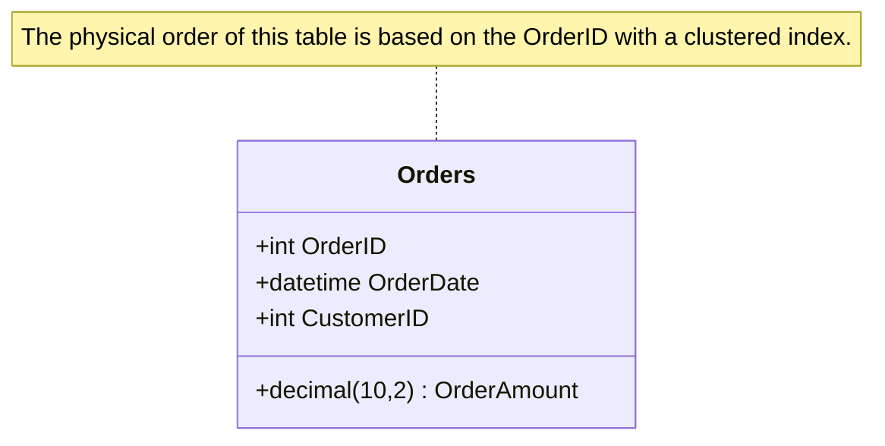

## Clustered Index

### Description

A **Clustered Index** is a type of database index that rearranges the physical order of the rows in a table to match the order of the index itself. It dictates the storage order of the keys and therefore, the data rows in the table. This alignment can significantly speed up data retrieval where sequential reads are frequent or large ranges of data are queried. The key attribute of a clustered index is that a given table can have only one clustered index, as the data rows themselves are stored in that particular sequence.

### Architectural Approaches

- **Single Index Per Table**: Each table can have only one clustered index. This is because the data rows themselves can only be stored in one order.
- **Primary Use for Range Queries**: Clustered indexes are particularly beneficial for queries that retrieve a range of values. These include operations on time-series data, ID ranges, etc.
- **Cost-Benefit Analysis**: While clustered indexes improve READ performance, especially for range-based queries, they may incur additional write performance costs due to the need for rearranging rows on updates and insertions.

### Best Practices

- **Strategic Key Selection**: Select the column or set of columns for the clustered index carefully; typically, it's best to choose columns often used in WHERE clause filters or ORDER BY clauses.
- **Minimal Updates**: Opt for columns that change infrequently to minimize the overhead associated with maintaining the clustered order.
- **Avoid Narrow Data Types for Keys**: While this may seem beneficial, using the smallest possible data type for key fields can lead to efficient storage and retrieval patterns.

### Example Code

Here's a SQL example illustrating the creation of a clustered index on a column:

```sql
CREATE TABLE Orders (
    OrderID int PRIMARY KEY CLUSTERED,
    OrderDate datetime,
    CustomerID int,
    OrderAmount decimal(10, 2)
);

-- As an alternative, we could create an index primarily on OrderDate 
-- assuming frequent queries are based on it:
CREATE CLUSTERED INDEX idx_OrderDate ON Orders(OrderDate);
```

### Diagrams



### Related Patterns

- **Non-Clustered Index**: Unlike clustered indexes, non-clustered indexes have a separate structure from the data rows.
- **Composite Index**: Involves multiple columns that together form the index key and is useful in complex queries.

### Additional Resources

- [Understanding Clustered vs Non-Clustered Indexes](https://www.sqlshack.com/understanding-clustered-and-non-clustered-indexes-in-sql-server/)
- [Designing an Effective Index Strategy](https://docs.microsoft.com/en-us/sql/relational-databases/sql-server-index-design-guide)

### Summary

The clustered index pattern is an essential tool for optimizing the performance and efficiency of data queries, particularly those that benefit from sequential access or filtered range queries. Properly implementing this pattern involves a careful balance of selecting the correct columns to maximize efficiency without incurring unnecessary overhead on data manipulation operations.
