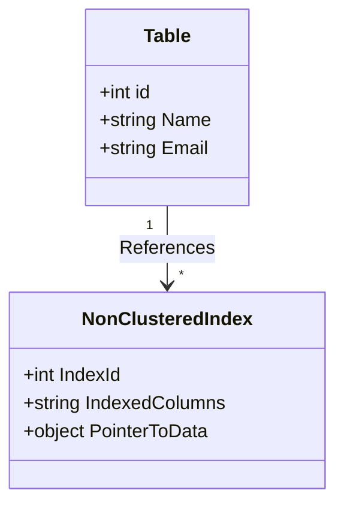

## Non-Clustered Index Pattern

### Overview

Non-clustered indexes create a structure separate from the data rows, which consists of a set of pointers that efficiently guide queries to the desired data. As opposed to clustered indexes, the data in the table is not re-arranged based on the index. Instead, the index keeps a pointer to the actual data location.

### Purpose

The main purpose of a non-clustered index is to improve the speed of data retrieval operations by providing a fast path to data locations within the database. This is especially useful for columns frequently used in search conditions or join clauses.

### Architectural Approaches

- **Separate Index Structure**: Non-clustered indexes have their storage structure distinct from the data tables, enabling rapid index access without impacting the table data layout.
- **Pointer-Based Access**: Each entry in a non-clustered index contains a reference to the actual data row using a row ID or a combination of clustering key values, primarily in cases of heap-organized tables or clustered tables, respectively.
- **Multi-Column Indexes**: Non-clustered indexes can cover multiple columns to support compound querying needs, thus enhancing the search capabilities when multiple fields are involved.

### Best Practices
- **Selective Indexing**: Create non-clustered indexes on columns used frequently in where clauses, sorts, or joins to accelerate performance.
- **Index Maintenance**: Regularly analyze and update index statistics for optimal query performance.
- **Balancing Index Usage**: Avoid over-indexing as it can lead to increased storage requirements and maintenance overhead.
- **Include Columns**: Use include non-key columns to add additional fields to the index for covering more queries without affecting the tree structure of the index.

### Example Code

Consider a simple example of creating a non-clustered index on the "Email" column in a SQL database:

```sql
CREATE NONCLUSTERED INDEX IX_Customers_Email
ON Customers (Email);
```

An index such as this optimizes queries that filter or sort based on the Email field, e.g., `SELECT * FROM Customers WHERE Email = 'example@example.com';`.

### UML Class Diagram



### Related Patterns

- **Clustered Index**: A different indexing strategy where the table's data rows are sorted based on the indexed column.
- **Covered Queries**: Queries that can be fully answered using an index alone without accessing the table data.
- **Bitmap Indexes**: Useful for columns with less distinct values.

### Additional Resources

- **"SQL Performance Explained" by Markus Winand** for a deeper understanding of SQL Server indexing.
- **Oracle Database SQL Tuning Guide** for practical advice on efficient indexing strategies.
- **AWS RDS Documentation** for leveraging indexes in cloud environments.

### Summary

The non-clustered index design pattern plays an instrumental role in optimizing relational database operations, providing fast data retrieval without redefining the physical data layout. Though powerful, careful design and judicious usage are key to harness its full potential, always balancing performance gains against storage and maintenance costs.
