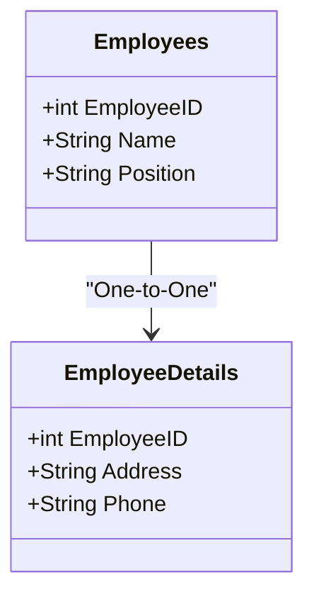

## Overview

The One-to-One Relationship design pattern in relational databases ensures that a single row in a table is associated with a single row in another table. This pattern is often used in scenarios where additional data fields are either conditionally required or can be logically separated to optimize schema design. The key takeaway is maintaining a strict one-to-one relationship between two datasets.

## Explanation

### Design Patterns

In MySQL or PostgreSQL, a one-to-one relationship can be modeled using:

1. **Primary Key to Primary Key**: Share the same primary key value in both tables.
2. **Foreign Key Constraint**: A unique foreign key in one table references the primary key in the other, ensuring a singular match.

### Architectural Approaches

1. **Logical Segregation**: Divide tables to keep required and optional columns separate. For example, a main table to hold consistently needed fields, and a secondary table for optional details.
   
2. **Horizontal Partitioning**: Use one-to-one relationships if certain datasets are frequently accessed together, optimizing data retrieval paths.

### Best Practices

- **Consistent PK/FK Policy**: Ensure that one-to-one relationships maintain primary key and foreign key constraints to enforce data integrity.
  
- **Data Normalization**: Regularly assess and normalize databases to remove redundancy, ensuring optimized data storage.

### Implementation

Here is a simple SQL implementation for a one-to-one relationship:

```sql
CREATE TABLE Employees (
   EmployeeID INT PRIMARY KEY,
   Name VARCHAR(100),
   Position VARCHAR(50)
);

CREATE TABLE EmployeeDetails (
   EmployeeID INT PRIMARY KEY,
   Address VARCHAR(255),
   Phone VARCHAR(15),
   FOREIGN KEY (EmployeeID) REFERENCES Employees(EmployeeID)
);
```

### Diagrams

Below is a UML diagram showcasing the One-to-One Relationship:



## Related Patterns

- **One-to-Many Relationship**: Differentiates as one record in a table can have multiple linked rows in another.
- **Many-to-Many Relationship**: Involves a junction table to manage many-to-many mappings.
- **Foreign Key Mapping**: Common foundational approach used in all relationship mapping situations.

## Additional Resources

- Documentation on [Data Normalization](https://en.wikipedia.org/wiki/Database_normalization)
- Official MySQL [Foreign Key Constraints](https://dev.mysql.com/doc/refman/8.0/en/create-table-foreign-keys.html)
- PostgreSQL [Data Definition](https://www.postgresql.org/docs/current/datatype.html)

## Summary

The One-to-One Relationship pattern is key to effectively handling scenarios where certain data attributes are unique and can be efficiently segregated from the primary dataset. By understanding and applying this pattern, database architects can design relational databases that are both performant and maintainable, reducing complexity and increasing clarity in data relationships.
