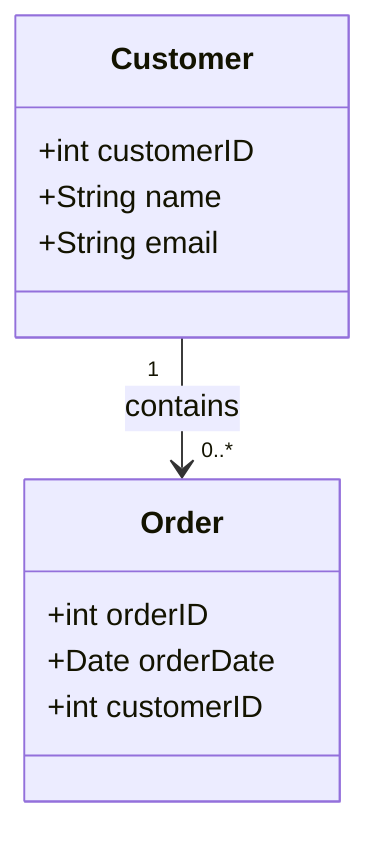

---

linkTitle: "One-to-Many Relationship"
title: "One-to-Many Relationship"
category: "1. Relational Modeling Patterns"
series: "Data Modeling Design Patterns"
description: "A design pattern where a record in one table can relate to multiple records in another table."
categories:
- relational-modeling
- database-design
- data-modeling
tags:
- one-to-many
- relationships
- sql
- relational-database
- data-architecture
date: 2024-07-07
type: docs
canonical: "https://softwarepatternslexicon.com/102/1/22"
license: "© 2024 Tokenizer Inc. CC BY-NC-SA 4.0"
---

**One-to-Many Relationship**

## Description

The One-to-Many Relationship is a fundamental concept in relational database design, representing a scenario where a single record in one table can be associated with multiple records in another table. This pattern is pivotal for structuring databases to reflect real-world entities and their interrelations effectively, ensuring data consistency and integrity.

### Conceptual Understanding

In relational databases, a table often symbolizes an entity (e.g., Customer, Order). The One-to-Many pattern allows a robust association between two entities, where one entity (the "one" side) has a collection of related entities (the "many" side). 

For instance, consider:
- **Customer Table** (One): Contains customer details where each customer has a unique identifier (CustomerID).
- **Orders Table** (Many): Contains order details where each order is associated with a particular customer through a foreign key (CustomerID).

### Subcategory: Relationships

This pattern falls under the broader category of Relationships, essential for constructing complex data-oriented applications. It is frequently used in object-relational mapping (ORM), data analysis, and reporting.

## Architectural Approaches

Implementing a One-to-Many Relationship in a relational database involves foreign key constraints that enforce the connection between the "one" and the "many" tables. It demands thoughtful index design for efficient query performance, particularly when joining tables or filtering related data.

### Primary Key and Foreign Key

- **Primary Key**: A unique identifier for each record in the "one" table.
- **Foreign Key**: A field (or combination of fields) in the "many" table that references the primary key in the "one" table.

In SQL:
```sql
CREATE TABLE Customers (
    CustomerID INT PRIMARY KEY,
    Name VARCHAR(100),
    Email VARCHAR(100)
);

CREATE TABLE Orders (
    OrderID INT PRIMARY KEY,
    OrderDate DATE,
    CustomerID INT,
    FOREIGN KEY (CustomerID) REFERENCES Customers(CustomerID)
);
```

## Best Practices

- **Normalization**: Ensure the database is normalized to eliminate redundancy and ensure consistency.
- **Indexing**: Utilize indexes on foreign keys to enhance join operations and improve query performance.
- **Cascading Actions**: Implement cascading deletes or updates if logical within the application context to maintain referential integrity.
- **ORM Mappings**: When using ORMs like Hibernate or Entity Framework, correctly configure one-to-many relationships to automatically handle data fetching.

## Example Code

Here's an example using Java with Hibernate, an ORM framework:
```java
@Entity
public class Customer {
    @Id
    @GeneratedValue(strategy = GenerationType.IDENTITY)
    private Long id;
    private String name;

    @OneToMany(mappedBy = "customer", cascade = CascadeType.ALL)
    private Set<Order> orders = new HashSet<>();
}

@Entity
public class Order {
    @Id
    @GeneratedValue(strategy = GenerationType.IDENTITY)
    private Long id;
    private Date orderDate;

    @ManyToOne
    @JoinColumn(name = "customer_id")
    private Customer customer;
}
```

## Diagrams

Below is a simple Mermaid UML diagram illustrating the One-to-Many Relationship:



## Related Patterns

- **Many-to-Many Relationship**: Extends the complexity where records in two tables can relate to multiple records in each other through an intermediary table.
- **One-to-One Relationship**: A simpler association where a record in one table relates to only one record in another table.

## Additional Resources

- [Relational Database Normalization](https://en.wikipedia.org/wiki/Database_normalization)
- [Understanding SQL Joins](https://www.dataversity.net/sql-joins/)

## Summary

The One-to-Many Relationship pattern is fundamental in relational database design, enabling scalable and efficient data models that reflect real-world complexity. By adhering to best practices and leveraging proper architectural tools, developers can ensure robust data integrity and performance in their applications.

---
