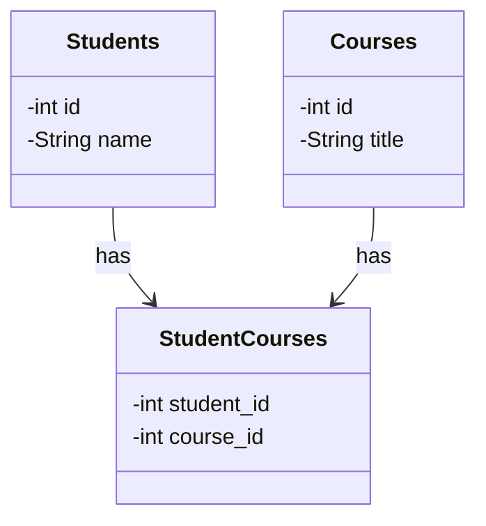
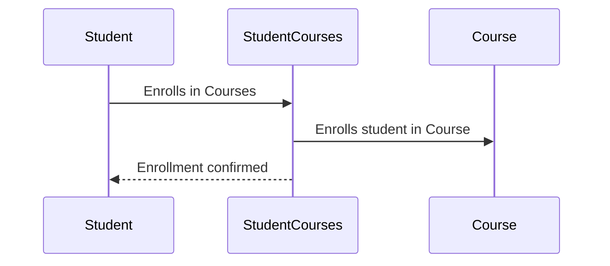

## Introduction

In relational database design, the many-to-many relationship pattern is commonly used to represent entities that can have multiple connections with each other. This relationship can be effectively modeled using a join table.

## Description

A many-to-many relationship occurs when each record in one table can relate to multiple records in another table and vice versa. For instance, consider the relationship between students and courses in an educational setting, where a student can enroll in many courses, and each course can have many students.

### Join Table

To implement this type of relationship, a join table is used. The join table contains foreign key columns that refer to the primary keys of the tables it connects. This approach effectively decouples the two entities, allowing for multiple connections without duplicating data.

### Example

Let's consider the following schema:

- **Students Table**: Stores student details.
  - `id`: Primary Key
  - `name`
  
- **Courses Table**: Stores course details.
  - `id`: Primary Key
  - `title`
  
- **StudentCourses Table**: Acts as the join table.
  - `student_id`: Foreign Key referencing `Students(id)`
  - `course_id`: Foreign Key referencing `Courses(id)`

### SQL Example

Here's how you might define the tables in SQL:

```sql
CREATE TABLE Students (
  id INT PRIMARY KEY,
  name VARCHAR(100)
);

CREATE TABLE Courses (
  id INT PRIMARY KEY,
  title VARCHAR(100)
);

CREATE TABLE StudentCourses (
  student_id INT,
  course_id INT,
  PRIMARY KEY (student_id, course_id),
  FOREIGN KEY (student_id) REFERENCES Students(id),
  FOREIGN KEY (course_id) REFERENCES Courses(id)
);
```

## Architectural Approaches

### Normalization

Using a join table to manage a many-to-many relationship is part of database normalization. This method helps prevent data anomalies and reduces redundancy.

### Indexing

To optimize query performance, particularly with large datasets, ensure that foreign key columns in the join table are indexed.

## Best Practices

- **Naming Conventions**: Choose clear and consistent naming conventions for join tables, typically combining the names of the two related entities (e.g., StudentCourses).
- **Constraints**: Utilize foreign key constraints to maintain referential integrity.
- **Handling Deletions**: Consider the impact of deletions. If a course or student is removed, decide how the join relationships should be adjusted.

## Diagrams

### UML Class Diagram



### Sequence Diagram



## Related Patterns

- **One-to-Many Relationship**: Used when one table's row can relate to many rows in another table.
- **Many-to-One Relationship**: The inverse of a one-to-many relationship.
- **Self-Referencing Table**: When records in a table relate to other records within the same table.

## Additional Resources

- [Relational Database Design – The Complete Guide](https://example.com/database-design-guide)
- [SQL Subquery Best Practices](https://example.com/sql-subquery)
- [SQL Foreign Key Constraints](https://example.com/sql-foreign-keys)

## Summary

The many-to-many relationship pattern in relational databases provides a flexible way to represent associations between two entities. By using a join table, you can maintain data integrity and support complex queries that involve these relationships, promoting an efficient and scalable database design.
