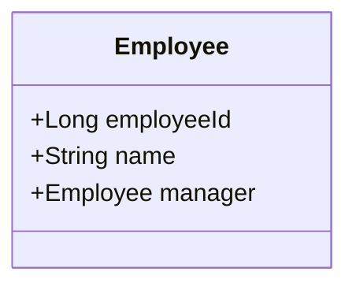

---

linkTitle: "Self-Referencing Relationship"
title: "Self-Referencing Relationship"
category: "Relational Modeling Patterns"
series: "Data Modeling Design Patterns"
description: "A table that has a foreign key to itself, representing hierarchical data, commonly used in scenarios such as organizational structures to denote relationships like manager to employee."
categories:
- Relational Modeling
- Data Modeling
- Hierarchical Structures
tags:
- Self-Referencing Relationship
- Hierarchical Data
- SQL
- Database Design
- Data Modeling
date: 2024-07-07
type: docs
canonical: "https://softwarepatternslexicon.com/102/1/24"
license: "© 2024 Tokenizer Inc. CC BY-NC-SA 4.0"
---

## Introduction

The self-referencing relationship design pattern involves a table with a foreign key pointing to its own primary key. This pattern is particularly beneficial in modeling hierarchical data structures where elements have a hierarchical relationship with each other, such as organizational charts where each employee can report to another employee.

---

## Design Pattern Explanation

### Structure

- **Primary Key**: The main unique identifier for each row in the table.
- **Foreign Key**: A key that refers back to the table's own primary key.
  
### Example Scenario

Consider an "Employees" table where each record can be linked to another record through a "ManagerID" column. The "ManagerID" acts as a foreign key representing the employee’s manager within the same table.

```sql
CREATE TABLE Employees (
    EmployeeID INT PRIMARY KEY,
    Name VARCHAR(100) NOT NULL,
    ManagerID INT,
    FOREIGN KEY (ManagerID) REFERENCES Employees(EmployeeID)
);
```

### Use Cases

- **Organizational Hierarchies**: Tracking manager-subordinate relationships.
- **Nested Categories**: Categorization systems where categories can contain subcategories.
- **Folder Structures**: Directory trees where folders can contain subfolders.

---

## Best Practices

- **Constrain Depth Complexity**: Ensure queries that traverse the hierarchy have performance in consideration, especially with deeper hierarchical trees.
- **Indexing**: Indexing the foreign key column can improve performance of hierarchical data retrieval.
- **Handling Cycles**: Consider additional checks or constraints to prevent cycles in relationships if not allowed.

---

## Related Patterns

- **Adjacency List Model**: A similar method to represent tree structures in database tables.
- **Materialized Path**: Encodes the path from the root to each node as a string.
- **Nested Set Model**: Suitable for static trees which do not change frequently; represents hierarchies by storing left and right values.

---

## Example Code

In Java, if using an ORM like JPA, self-referencing can be depicted as follows:

```java
@Entity
public class Employee {

    @Id
    @GeneratedValue(strategy = GenerationType.IDENTITY)
    private Long employeeId;

    private String name;

    @ManyToOne
    @JoinColumn(name = "managerId")
    private Employee manager;

    // getters and setters
}
```

This structure defines a self-referencing `Employee` entity that models hierarchical data relationships.

---

## Diagrams

Here is a Mermaid UML Class Diagram illustrating the concept:



In this diagram, the `Employee` class contains a reference to itself, modeling the self-referencing relationship.

---

## Additional Resources

- [Relational Database Design – Self-References](https://www.database.guide)
- [Hierarchical Data in SQL](https://sqlfordevs.com/hierarchical-data)
- [Managing Hierarchical Data in MySQL](https://dev.mysql.com/tech-resources/articles/hierarchical-data.html)

---

## Summary

The self-referencing relationship pattern is a straightforward yet powerful approach to manage hierarchical data within a single table structure. Its utility covers various domains such as employee hierarchies, nested categories, and directory structures, making it a versatile pattern in relational modeling. Proper use and management, including indexing and query optimization, will lead to efficient performance and scalability of data-driven applications.

---
