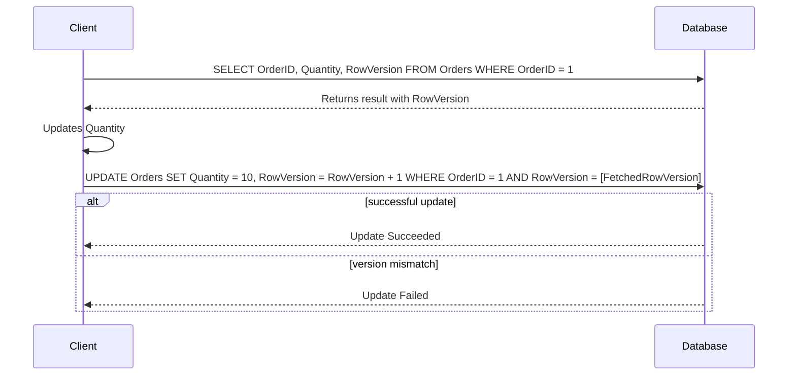

---

linkTitle: "Optimistic Locking"
title: "Optimistic Locking"
category: "1. Relational Modeling Patterns"
series: "Data Modeling Design Patterns"
description: "Handling concurrent data access by checking for changes before committing updates, without locking resources."
categories:
- Relational Modeling
- Concurrency Control
- Data Consistency
tags:
- Optimistic Locking
- Concurrency
- Data Integrity
- Versioning
- Database Patterns
date: 2024-07-07
type: docs
canonical: "https://softwarepatternslexicon.com/102/1/26"
license: "© 2024 Tokenizer Inc. CC BY-NC-SA 4.0"
---

## Optimistic Locking

Optimistic Locking is a concurrency control mechanism used in relational databases to handle simultaneous data access. It helps in maintaining data integrity by allowing multiple transactions to work with the same data concurrently. The primary philosophy behind this pattern is to assume that conflicts are rare and to offer conflict detection rather than prevention.

### Description

Optimistic Locking works on the assumption that while multiple transactions might be working concurrently, conflicts (such as data modification by another transaction between retrieval and update) are unlikely to happen. Instead of locking resources when reading data, Optimistic Locking checks for changes before data is committed. Typically, this involves examining a version number or timestamp to determine if a record was altered since it was initially read.

### Example Implementation

Consider a simple database table to illustrate Optimistic Locking implementation:

#### SQL Table Definition

```sql
CREATE TABLE Orders (
    OrderID INT PRIMARY KEY,
    ProductName VARCHAR(50),
    Quantity INT,
    Price DECIMAL,
    RowVersion INT DEFAULT 0
);
```

#### Application Logic

Here's the sequence of operations demonstrating how Optimistic Locking would be applied in an application updating an order's quantity:

1. **Read Operation**: Fetch an order record along with its current `RowVersion`.

    ```sql
    SELECT OrderID, ProductName, Quantity, Price, RowVersion FROM Orders WHERE OrderID = 1;
    ```

2. **Modify the Data**: Adjust `Quantity` as necessary in your business logic.

3. **Update Operation**: Attempt to update the order only if the `RowVersion` has not changed.

    ```sql
    UPDATE Orders
    SET Quantity = 10, RowVersion = RowVersion + 1
    WHERE OrderID = 1 AND RowVersion = [FetchedRowVersion];
    ```

4. **Conflict Detection**: If the `RowVersion` was altered by another transaction, the update will fail, and you'll need to handle this usually by retrying the transaction.

### Diagrams

Below is a simplified Mermaid UML Sequence Diagram illustrating the optimistic locking workflow:



### Architectural Approaches

- **Versioning**: Use a version column, typically an integer that increments with every update, enabling checks against the value read during initial fetch.
- **Timestamp**: Employ a timestamp column to store the last modification date and time, providing a natural ordering for conflict detection.
  
### Best Practices

- **Error Handling**: Always handle concurrency errors gracefully and implement retry logic where feasible.
- **Granularity**: Keep the scope of transaction logic limited to reduce the need for further concurrency checks.
- **Consistency**: Ensure the detection mechanism (version number, timestamp, etc.) is accurate and consistent.

### Related Patterns

- **Pessimistic Locking**: Contrasts with Optimistic Locking by utilizing actual locks to prevent concurrent access.
- **Optimistic Concurrency Control (OCC)**: A generalized concept often applied in distributed environments beyond simple versioning in databases.

### Additional Resources

- **Martin Fowler's Patterns of Enterprise Application Architecture**: A comprehensive guide that includes Optimistic Locking.
- **Database Management Systems, Raghu Ramakrishnan and Johannes Gehrke**: This textbook offers a deep dive into concurrency control and transactions.

### Summary

Optimistic Locking provides an efficient approach to handling concurrent data access in situations where the probability of conflict is low. By deferring conflict detection to just before commit, systems can minimize locking overhead, thereby improving throughput and scalability. Properly handling the potential conflicts with retries or application-specific logic ensures that data integrity is maintained without overly restricting concurrent data access.
