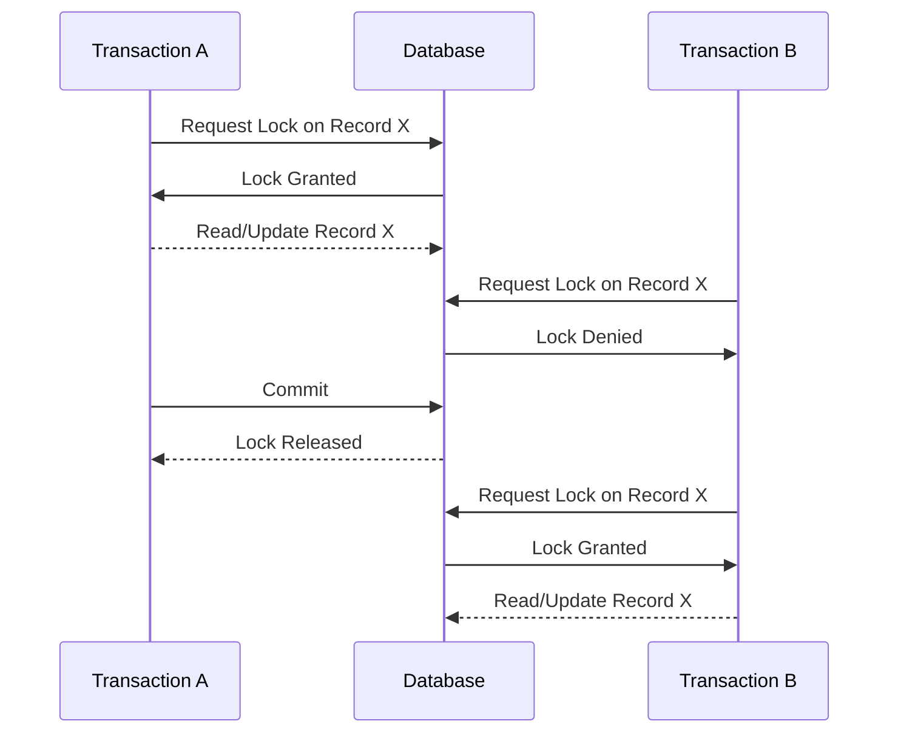

## Introduction

Pessimistic Locking is a design pattern primarily used in relational database systems to prevent concurrent access to data by locking the records when they are accessed. This locking mechanism ensures that data remains consistent and prevents conflicting changes that could arise due to the simultaneous operations on the same data point. Pessimistic Locking is a part of concurrency control strategies used to manage access to shared resources in environments where high data integrity is essential.

## Detailed Explanation

### Core Concept

In Pessimistic Locking, an exclusive lock is obtained on the data being accessed. This means the data cannot be read, modified, or deleted by other transactions until the lock is released. Pessimistic Locking is usually deployed in scenarios with high contention for resources and where the likelihood of collisions (simultaneous updates) is high. This approach prioritizes data consistency over latency by preventing parallel operations.

### Operation

- **Lock Acquisition**: When a transaction starts and requires access to a record, it requests a lock.
- **Exclusive Lock**: The lock is exclusive, preventing any other transaction from accessing the same record.
- **Lock Holding**: The lock is held until the transaction completes, ensuring the data cannot be changed by others.
- **Lock Release**: Once the transaction is committed or rolled back, the lock is released, allowing other transactions to access the data.

### Example Use Case

Consider a banking application where multiple transactions might attempt to modify the same account balance. To ensure consistency, when one transaction modifies the account balance, it locks the account record, preventing other transactions from accessing it until the operation is complete.

```sql
BEGIN TRANSACTION;
LOCK TABLE account_balance IN EXCLUSIVE MODE;
UPDATE account_balance SET balance = balance - 100 WHERE account_id = 12345;
COMMIT;
```

In the above SQL example, an exclusive lock is placed on the `account_balance` table, ensuring that no other modifications can be made until the transaction is committed.

## Diagrams

### Pessimistic Locking Flow



## Related Patterns

- **Optimistic Locking**: Unlike Pessimistic Locking, Optimistic Locking allows multiple transactions to access a record simultaneously, but checks for conflicts before committing changes.
- **Transaction Isolation Levels**: Different transaction isolation levels can simulate pessimistic behavior by controlling the visibility of changes across transactions.
- **Latches and Mutexes**: In the context of application-level concurrency, latches and mutexes provide similar lock mechanisms used in multitasking within a single system.

## Best Practices

- **Use Judiciously**: Due to its blocking nature, use Pessimistic Locking judiciously to prevent performance bottlenecks.
- **Prioritize Critical Sections**: Apply Pessimistic Locking to critical sections of the application where data consistency is paramount.
- **Balance Consistency and Latency**: Consider a balanced approach that accounts for application responsiveness and data integrity.

## Additional Resources

- [Database System Concepts](https://link.to/resource)
- [Effective Practices for Concurrency Control](https://link.to/resource)

## Summary

Pessimistic Locking is a robust design pattern used to preserve data integrity in highly contentious transaction environments by preventing concurrent write access to records. By carefully acquiring and managing locks, this approach ensures that modifications occur without conflict, thus maintaining database consistency, albeit possibly at the cost of reduced system throughput. By understanding and applying Pessimistic Locking appropriately, architects can design systems that achieve desired levels of reliability and accuracy.
