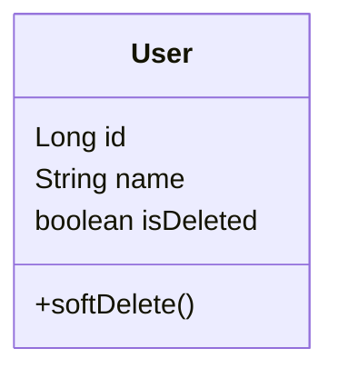

## Description

Soft Deletes is a data modeling pattern that involves marking records as inactive or deleted by setting a flag or status in the database, rather than permanently deleting the data. The objective is to preserve historical information and maintain data integrity by allowing the records to be "undeleted" or audited as needed. This approach is commonly used in relational database scenarios where data recovery, auditing, or version history is essential.

## Architectural Approaches

Implementing soft deletes usually involves:

1. **Adding a Flag Column**: Introducing an additional column, commonly known as `IsDeleted` or `DeletedAt`, to represent the status of each record.
2. **Ensuring Logical Deletions**: Modifying application logic to update the flag rather than removing the entry from the database.
3. **Custom Query Logic**: Adapting data retrieval queries to filter out inactive records unless explicitly requested.

## Paradigms and Best Practices

- **Database Schema Alteration**: Add a boolean `IsDeleted` column or a timestamp `DeletedAt` to track the deletion status or time.
- **Indexing**: Consider indexing the flag column to improve performance on filtering operations.
- **Auditing and History**: Enhance traceability by maintaining a history of changes or reason for deletion.
- **Application Logic**: Always perform update operations to soft delete a record and adjust business logic to handle the deletion status.
- **Validation Checks**: Incorporate validation logic to ensure data consistency and prevent unintentional "reactivation" of soft-deleted records.

## Example Code

Here's an example demonstrating soft deletes in SQL for a `Users` table.

```sql
ALTER TABLE Users ADD COLUMN IsDeleted BOOLEAN DEFAULT FALSE;

-- Soft delete user
UPDATE Users SET IsDeleted = TRUE WHERE UserId = 123;

-- Query for non-deleted users
SELECT * FROM Users WHERE IsDeleted = FALSE;
```

For applications adhering to object-oriented paradigms, adjusting the data handling logic is crucial:

```java
class User {
    private Long id;
    private String name;
    private boolean isDeleted = false;

    public void softDelete(){
        this.isDeleted = true;
    }

    // Other fields and methods...
}
```

## Diagrams

Below is a UML Class Diagram for the `User` class, illustrating the soft delete attribute:



## Related Patterns

- **Audit Log**: Provides a history of deleted records and their changes.
- **Hard Deletes**: In contrast, this pattern involves permanent deletion of records without retention of data.
- **Logical Deletion**: Similar to soft deletes but with more emphasis on application logic control.
- **Versioned Data**: Captures previous states of data typically accompanied by soft deletes for comprehensive data recovery.

## Additional Resources

- [Soft Deletes in Entity Framework](https://docs.microsoft.com/en-us/ef/core/modeling/entity-types#soft-delete)
- [Handling Soft Deletes in SQL Server](https://docs.microsoft.com/en-us/sql/relational-databases?tutorial=introduction-to-soft-deletes)
- Books: "Database Design for Mere Mortals" by Michael J. Hernandez for foundational knowledge on database design patterns, including deletion strategies.

## Summary

Soft Deletes is a strategic approach to manage data deletion by marking records inactive rather than entirely removing them from databases. This pattern supports data recovery, auditing, and historical data perseverance, which are vital for maintaining accurate data records and meeting compliance requirements. Proper integration of this pattern involves adjustments at both the database schema level and application logic, ensuring efficient data operations and system integrity.
