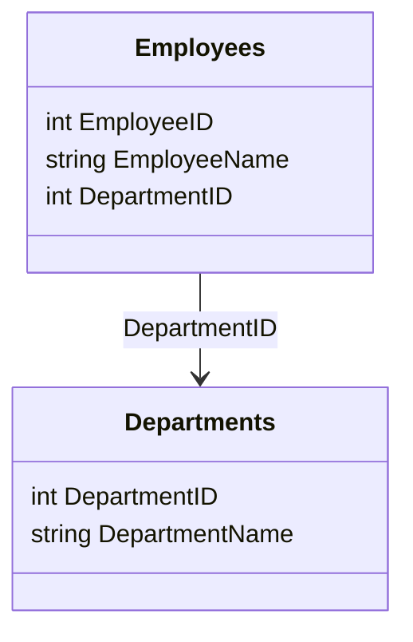

---

linkTitle: "Third Normal Form (3NF)"
title: "Third Normal Form (3NF)"
category: "Relational Modeling Patterns"
series: "Data Modeling Design Patterns"
description: "Third Normal Form (3NF) is a database normalization form that eliminates transitive dependencies while ensuring all non-key attributes depend solely on the primary key, thus optimizing the database structure."
categories:
- Relational Databases
- Data Modeling
- Normalization
tags:
- 3NF
- Database Design
- Normalization
- Relational Modeling
- Data Integrity
date: 2024-07-07
type: docs

canonical: "https://softwarepatternslexicon.com/102/1/3"
license: "© 2024 Tokenizer Inc. CC BY-NC-SA 4.0"
---

## Third Normal Form (3NF)

**Third Normal Form (3NF)** is a critical step in the normalization process of relational database design. It addresses the issues of transitive dependencies by ensuring that non-key attributes are dependent only on primary keys. This prevents anomalies and reduces redundancy, leading to improved data integrity and efficiency.

### Description

The Third Normal Form is achieved when a database table meets the following requirements:

1. **It is in Second Normal Form (2NF):** The table must have eliminated partial dependencies, meaning every non-primary-key attribute is fully functional dependent on the entire primary key.

2. **Elimination of Transitive Dependencies:** There should be no transitive dependencies for non-prime attributes. In other words, non-key attributes must not depend on other non-key attributes.

By ensuring these conditions, the database design minimizes redundancy and focuses on promoting data integrity.

### Example

Consider a table representing employees:

| EmployeeID | EmployeeName | DepartmentID | DepartmentName |
|------------|--------------|--------------|----------------|
| 1          | John Doe     | 101          | HR             |
| 2          | Jane Smith   | 102          | IT             |

In its existing form, a transitive dependency exists as `DepartmentName` depends on `DepartmentID`, which is not the primary key. To satisfy 3NF, restructure this data into two tables:

**Employees Table:**

| EmployeeID | EmployeeName | DepartmentID |
|------------|--------------|--------------|
| 1          | John Doe     | 101          |
| 2          | Jane Smith   | 102          |

**Departments Table:**

| DepartmentID | DepartmentName |
|--------------|----------------|
| 101          | HR             |
| 102          | IT             |

In this revised structure, `DepartmentName` is linked with `DepartmentID` in a separate table, thus removing the transitive dependency.

### Architectural Approaches

- **Separation of Concerns**: By minimizing dependencies, each table is focused on a single concept, enhancing maintainability.
- **Data Integrity**: Promotes data integrity by preventing update, delete, and insertion anomalies.
- **Efficient Query Processing**: Allows more efficient querying and updates by reducing complex joins and redundant data.

### Paradigms and Best Practices

- **Consistent Application**: Apply normalization consistently across all tables to ensure uniformity and reduce errors.
- **Identify Functional Dependencies**: Carefully analyze functional dependencies to detect and resolve transitive dependencies.
- **Iterative Refinement**: Don’t normalize beyond necessity; over-normalization can lead to performance issues.

### Example Code

Here's an SQL snippet illustrating how you might implement these tables:

```sql
CREATE TABLE Departments (
    DepartmentID INT PRIMARY KEY,
    DepartmentName VARCHAR(50)
);

CREATE TABLE Employees (
    EmployeeID INT PRIMARY KEY,
    EmployeeName VARCHAR(50),
    DepartmentID INT,
    FOREIGN KEY (DepartmentID) REFERENCES Departments(DepartmentID)
);
```

### Diagrams

A simple entity-relationship diagram showing the normalized structure could be represented as:



### Related Patterns

- **First Normal Form (1NF)**: Ensure that all column values are atomic and the table has a primary key.
- **Second Normal Form (2NF)**: Remove partial dependencies from the table.

### Additional Resources

- **Books**: "Database System Concepts" by Abraham Silberschatz et al., for a comprehensive understanding of database theory.
- **Online Courses**: Coursera's "Database Management Essentials" which covers fundamental concepts including normalization.
- **Documentation**: SQL standard documentation provides in-depth explanations of normalization best practices.

### Summary

3NF is a vital pattern in the architecture of relational databases. It enforces integrity constraints by eliminating transitive dependencies, ensuring that non-key attributes are exclusively dependent on primary keys. Employing 3NF effectively guarantees enhanced consistency, preventing data anomalies while fostering a scalable and maintainable database structure.

Understanding and applying 3NF enables enterprises to maintain high data quality and ensures efficient and reliable database systems conducive to complex querying and transactions—a cornerstone of robust data architecture.
