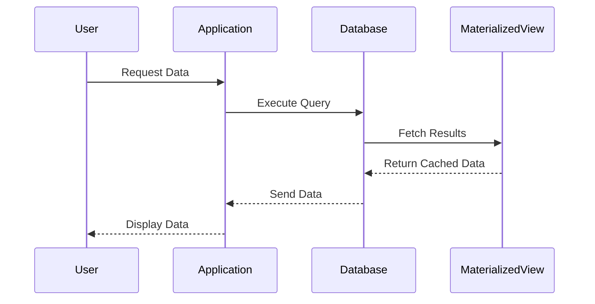

## Overview

Materialized Views are a powerful design pattern in database systems used to optimize query performance. By storing the result of a query physically, these views allow for quick access to data that would otherwise require complex and resource-intensive queries. This pattern is beneficial when dealing with large datasets and when there is a demand for high-performance read operations.

## Detailed Explanation

### Definition

A Materialized View is a database object that contains the results of a query. Unlike a standard view that calculates its data dynamically, a materialized view saves the query output on disk. This results in faster read access, as the database can retrieve data directly from the stored result set rather than calculating it from scratch each time.

### Use Cases

1. **Performance Enhancement**: Materialized Views are ideal for aggregating data, such as computing sums, averages, or counts, especially in OLAP systems.
2. **Resource-Intensive Queries**: When executing queries that involve large joins, aggregations, or complex calculations, materialized views can significantly reduce the computational load and time needed.
3. **Data Summarization**: They are used for reporting purposes where datasets are summarized, such as daily sales totals, monthly department expenses, etc.

### Architectural Approaches

1. **Full Refresh vs. Incremental Refresh**: 
   - **Full Refresh**: Recalculating the entire view, replacing old data with new data.
   - **Incremental Refresh**: Only updating parts of the view that have changed since the last refresh, which is more efficient for large datasets.

2. **Manual vs. Automatic Refresh**:
   - **Manual Refresh**: The DBA triggers the refresh based on predefined schedules or conditions.
   - **Automatic Refresh**: The system triggers refreshes automatically, at fixed intervals or based on changes in underlying data.

### Example Code

```sql
-- Creating a Materialized View for Daily Sales Totals
CREATE MATERIALIZED VIEW Daily_Sales_Summary
BUILD IMMEDIATE
REFRESH FAST ON COMMIT
AS 
SELECT 
    date, 
    product_id, 
    SUM(quantity_sold) AS total_quantity_sold, 
    SUM(sales_amount) AS total_sales
FROM 
    sales
GROUP BY 
    date, product_id;
```

### Diagrams

Below is a simple sequence diagram that represents the process of using a Materialized View for a query:



### Related Patterns

- **Indexes**: While both Materialized Views and Indexes optimize query performance, indexes enhance data retrieval speed without precomputing data. In contrast, materialized views store computed results.
- **Cache-aside Pattern**: This pattern allows applications to load data into cache on-demand. Both patterns emphasize performance, but materialized views are focused on pre-stored query results.

### Additional Resources

- [Oracle Materialized Views Documentation](https://docs.oracle.com/database/121/DWHSG/general.htm#DWHSG015)
- [PostgreSQL Materialized Views](https://www.postgresql.org/docs/current/rules-materializedviews.html)
- [IBM Db2 and Materialized Query Tables](https://www.ibm.com/docs/en/db2/11.5?topic=tables-materialized-query)

## Summary

Materialized Views are a crucial design pattern in optimizing database performance, especially when dealing with complex queries and large datasets. By storing the results of intensive queries, they reduce processing time and enhance the performance of applications running over relational databases. Understanding when and how to use materialized views effectively can lead to significant improvements in data retrieval times and application responsiveness.
