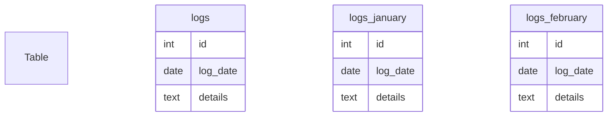

## Partitioning Tables

### Description
Partitioning tables is a vital design pattern used to optimize the performance of relational databases. It involves breaking down large tables into smaller, more manageable segments without impacting the logical view of the table. This segmentation is commonly based on columns such as date ranges or unique key values, allowing efficient data retrieval and improved system performance. When tables grow excessively large, they can negatively impact query performance and data maintenance operations such as backup, restore, and vacuum.

### Design Pattern and Architectural Approaches

#### Types of Partitioning:
1. **Range Partitioning**:
   - Data is distributed according to a specified range of values. For example, date ranges (monthly, yearly) are often used for partitioning time-series data.
   - Each partition handles a different range of the index value.

2. **List Partitioning**:
   - Distributes data based on a list of discrete values. For example, a table could be partitioned according to geographic regions.

3. **Hash Partitioning**:
   - Data is uniformly distributed across partitions using a hash function applied to partition keys. This method is suitable for ensuring even data distribution.

4. **Composite Partitioning**:
   - Also known as sub-partitioning, it involves applying multiple partitioning strategies. You might use range partitioning on dates combined with hash partitioning on user IDs.

#### Best Practices

- **Choose the Right Partition Key**: Select a key with uniform data distribution to avoid unbalanced partitions, which can lead to performance bottlenecks.
  
- **Monitor Performance**: Continuous monitoring is crucial for determining the efficacy of partition strategies and making necessary adjustments.
  
- **Use Partition Pruning**: Enable query optimizations by only scanning the necessary partitions.

- **Automate Partition Management**: Implement scripts or tools to handle partition creation, maintenance, and deletion processes automatically to reduce manual workload.

### Example Code

```sql
-- Example of creating a partitioned table in PostgreSQL using range partitioning.
CREATE TABLE logs (
  id SERIAL PRIMARY KEY,
  log_date DATE NOT NULL,
  details TEXT
) PARTITION BY RANGE (log_date);

CREATE TABLE logs_january PARTITION OF logs
FOR VALUES FROM ('2024-01-01') TO ('2024-02-01');

CREATE TABLE logs_february PARTITION OF logs
FOR VALUES FROM ('2024-02-01') TO ('2024-03-01');
```

### Diagrams



### Related Patterns

- **Sharding**: While partitioning involves breaking a table within a single database instance, sharding distributes data across multiple instances.
  
- **Normalization vs Denormalization**: The decision to partition often occurs in the context of how you wish to structure data redundancy and retrieval requirements.

### Additional Resources

- [PostgreSQL Partitioning Documentation](https://www.postgresql.org/docs/current/partitioning.html)
- [Oracle Partitioning Guide](https://docs.oracle.com/en/database/oracle/oracle-database/19/dwhsg/partitioning.html)
- [SQL Server Partitioning Best Practices](https://docs.microsoft.com/en-us/sql/relational-databases/partitions/partition-tables-and-indexes)

### Summary

Partitioning tables is a strategic design pattern that aids in managing and optimizing large datasets in relational databases by dividing them into smaller, manageable segments. This approach can significantly enhance query performance and simplify maintenance. Using proper partitioning methods and regularly monitoring performance are essential steps in leveraging the full benefits of this pattern.
