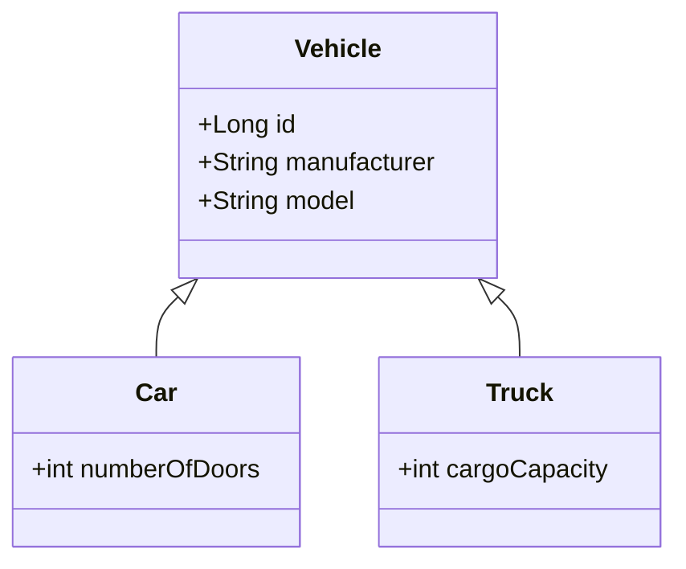

## Inheritance Mapping

### Description

Inheritance Mapping is a design pattern utilized in relational databases to effectively model and manage inheritance hierarchies typically found in object-oriented programming. This pattern aims to bridge the gap between object-oriented design and relational database structures through various techniques, each with its benefits and trade-offs.

### Inheritance Mapping Techniques

1. **Single Table Inheritance**:
   - **Concept**: All classes in the hierarchy are mapped to a single table. Each record includes a special column indicating the type of subclass, known as a discriminating column.
   - **Advantages**: Simplifies queries, as all data resides in one table; easier to manage.
   - **Disadvantages**: Can lead to a lot of null columns if subclasses have distinct fields.
   - **Example**:
     ```sql
     CREATE TABLE Vehicles (
       VehicleID INT PRIMARY KEY,
       Manufacturer VARCHAR(100),
       Model VARCHAR(100),
       VehicleType VARCHAR(50),
       CargoCapacity INT, -- Null for Cars
       NumberOfDoors INT  -- Null for Motorcycles
     );
     ```

2. **Class Table Inheritance**:
   - **Concept**: Each class in the hierarchy gets its table. The base class table handles common fields, with each subclass having its table for specific fields.
   - **Advantages**: Avoids nulls and allows better type and constraint management.
   - **Disadvantages**: Queries become more complex due to joins between tables.
   - **Example**:
     ```sql
     CREATE TABLE Vehicles (
       VehicleID INT PRIMARY KEY,
       Manufacturer VARCHAR(100),
       Model VARCHAR(100)
     );

     CREATE TABLE Cars (
       VehicleID INT PRIMARY KEY,
       NumberOfDoors INT,
       FOREIGN KEY (VehicleID) REFERENCES Vehicles(VehicleID)
     );

     CREATE TABLE Trucks (
       VehicleID INT PRIMARY KEY,
       CargoCapacity INT,
       FOREIGN KEY (VehicleID) REFERENCES Vehicles(VehicleID)
     );
     ```

3. **Concrete Table Inheritance**:
   - **Concept**: Each subclass has its table, including fields from the superclass. There's no table for the abstract superclass.
   - **Advantages**: No joins are necessary when querying subclass data, making operations faster.
   - **Disadvantages**: Redundancy in shared fields across tables.
   - **Example**:
     ```sql
     CREATE TABLE Cars (
       VehicleID INT PRIMARY KEY,
       Manufacturer VARCHAR(100),
       Model VARCHAR(100),
       NumberOfDoors INT
     );

     CREATE TABLE Trucks (
       VehicleID INT PRIMARY KEY,
       Manufacturer VARCHAR(100),
       Model VARCHAR(100),
       CargoCapacity INT
     );
     ```

### Best Practices

- Choose Single Table Inheritance for simplicity and when subclasses share many common attributes.
- Opt for Class Table Inheritance when you need clarity on data constraints and type safety.
- Select Concrete Table Inheritance for performance optimization when dealing with specific subclass queries.
- Use consistent and clear naming conventions for tables and columns.
- Ensure data integrity through appropriate foreign key constraints and indexes.

### Example Code

Here's how you might map single table inheritance using an ORM like Hibernate in Java:

```java
@Entity
@Inheritance(strategy = InheritanceType.SINGLE_TABLE)
@DiscriminatorColumn(name = "VehicleType", discriminatorType = DiscriminatorType.STRING)
public abstract class Vehicle {
    @Id
    @GeneratedValue(strategy = GenerationType.IDENTITY)
    private Long id;
    private String manufacturer;
    private String model;
    // Getter and setter methods
}

@Entity
@DiscriminatorValue("Car")
public class Car extends Vehicle {
    private int numberOfDoors;
    // Getter and setter methods
}

@Entity
@DiscriminatorValue("Truck")
public class Truck extends Vehicle {
    private int cargoCapacity;
    // Getter and setter methods
}
```

### Diagrams

Here is a Class Diagram demonstrating Class Table Inheritance using Mermaid UML:



### Related Patterns

- **Composite Pattern**: Used for hierarchies where each node is either a primitive object or composite of objects.
- **Data Mapper Pattern**: Encapsulates data access logic and object-relational mapping.
- **Repository Pattern**: Provides an abstraction over the data access layer.

### Additional Resources

- [Martin Fowler's Descriptions of Inheritance Mapping](https://martinfowler.com/eaaCatalog/inheritanceMappers.html)
- [Object-Relational Mapping Concepts](https://hibernate.org/orm/)
- [Relational Database Antipatterns](https://www.oreilly.com/library/view/relational-database-design/9781449330183/)

### Summary

Inheritance Mapping enables effective representation of object-oriented inheritance within relational databases. Choosing the right strategy can significantly impact system performance, maintainability, and complexity. By understanding the specific needs of your application and data model, you can select the most suitable inheritance mapping technique for your use case.
