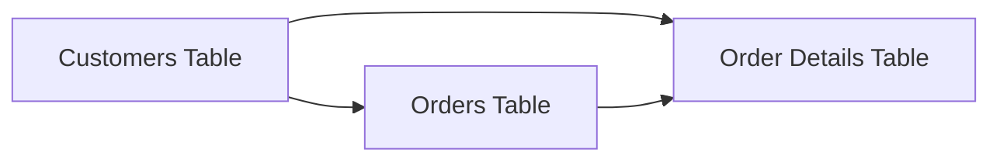
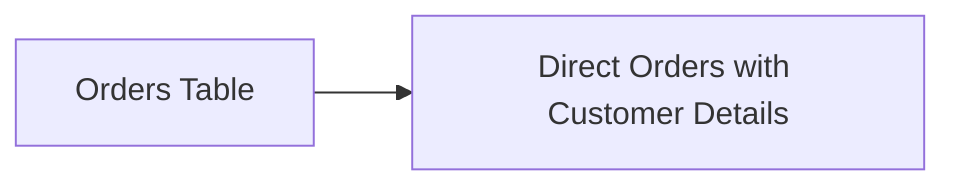

## Introduction to Denormalization

Denormalization is a data optimization technique used primarily in relational database design to enhance the performance of database read operations by reducing the need for complex joins. This process involves intentionally introducing redundancy into a database schema, usually by combining tables or duplicating data. The trade-off is between improved query performance and the increased storage overhead and complexity in maintaining data consistency.

## Architectural Approach

In a normalized database, data is organized to minimize redundancy and dependency, often through the creation of multiple related tables. This organization can sometimes result in performance bottlenecks, especially when complex joins are needed to retrieve data for read-heavy applications. 

Denormalization addresses this by:
- **Flattening Tables**: Combining related tables into a single table to eliminate the need for joins.
- **Duplicating Data**: Copying frequently accessed attributes into multiple tables to speed up read operations.

These changes reduce the number of database reads and computation required during data retrieval, making applications more responsive.

## Best Practices

1. **Identify Read-Heavy Workloads**: Denormalization is most beneficial when the workload is predominantly read-heavy and involves complex queries that result in expensive joins.

2. **Assess Redundancy Costs**: Carefully evaluate the impact of increased storage needs and the potential for data inconsistency.

3. **Maintain Data Consistency**: Implement mechanisms to keep duplicated data consistent. This might involve using triggers, stored procedures, or application-layer logic to update redundant fields across related tables.

4. **Balance Performance and Storage**: Consider the trade-offs between performance gains and added storage or maintenance costs.

## Example Code

Consider a simple example involving two tables: `Customers` and `Orders`. 

**Normalized schema:**
```sql
CREATE TABLE Customers (
    CustomerID INT PRIMARY KEY,
    Name VARCHAR(100),
    Address VARCHAR(255)
);

CREATE TABLE Orders (
    OrderID INT PRIMARY KEY,
    CustomerID INT,
    OrderDate DATETIME,
    Amount DECIMAL(10, 2),
    FOREIGN KEY (CustomerID) REFERENCES Customers(CustomerID)
);
```

**Denormalized schema:**
```sql
CREATE TABLE Orders (
    OrderID INT PRIMARY KEY,
    CustomerID INT,
    CustomerName VARCHAR(100),
    CustomerAddress VARCHAR(255),
    OrderDate DATETIME,
    Amount DECIMAL(10, 2)
);
```
In this schema, `CustomerName` and `CustomerAddress` are directly included in the `Orders` table, eliminating the need for a join to the `Customers` table when retrieving orders with customer details.

## Diagrams

### Denormalization Process



### After Denormalization



## Related Patterns

- **Normalization**: The process of structuring a relational database to reduce redundancy and improve data integrity.
- **Indexing**: Another common optimization strategy aimed at speeding up data retrieval operations.

## Additional Resources

- [Database Design - Advanced Denormalization](https://example.com)
- [Trade-offs in Database Design](https://example.com)
- [How to Balance Performance and Consistency](https://example.com)

## Summary

Denormalization is a strategic choice for database designers and architects to optimize read-heavy applications by reducing the need for complex joins. While it increases redundancy, with careful management, it effectively boosts performance for specific use cases. Balancing the benefits against the costs is crucial to ensuring scalable and efficient data architectures.
