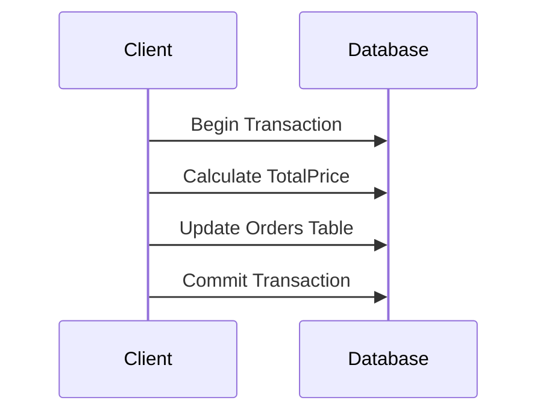

## Adding Redundant Data Design Pattern

### Overview

The Adding Redundant Data pattern, also referred to as denormalization, involves storing duplicate data within a database system to improve the performance of queries and reduce the computational costs associated with complex joins. This technique can be crucial in scenarios where read-heavy operations are critical, and the cost of data storage is acceptable in comparison to the benefits gained in query speed and simplicity.

### Description

In traditional database design, normalization is used to eliminate redundancy, ensuring data integrity and minimizing storage costs. However, normalized databases often involve multiple table joins to retrieve related data, which can be computationally expensive, especially when dealing with large datasets or complex queries. By strategically adding redundant data, also known as denormalizing, unnecessary join operations can be avoided, and query efficiency can be greatly improved.

### Example

Consider a simple e-commerce database with the following tables:

#### Orders Table

| OrderID | CustomerID | OrderDate | TotalPrice |
|---------|------------|-----------|--------------|
| 1       | 1001       | 2024-07-01| 135.75       |
| 2       | 1002       | 2024-07-03| 72.50        |

#### OrderItems Table

| ItemID | OrderID | ProductID | Quantity | UnitPrice |
|--------|---------|-----------|----------|-----------|
| 101    | 1       | 2001      | 2        | 45.00     |
| 102    | 1       | 2002      | 1        | 45.75     |
| 103    | 2       | 2001      | 1        | 45.00     |
| 104    | 2       | 2003      | 3        | 9.17      |

In this example, the `TotalPrice` field in the `Orders` table is considered redundant, as it can be computed by summing up the product of `Quantity` and `UnitPrice` from the `OrderItems` table for each order. However, by adding this field directly to the `Orders` table, you can streamline reporting queries that need only retrieve the total price per order without performing a potentially expensive join and aggregation operation.

### Architectural Considerations

- **Consistency**: Ensure that all duplicate data is updated consistently across the database. This typically involves additional logic during data manipulation operations.
- **Performance vs. Storage**: Balance the trade-offs between improved read performance and increased storage requirements, alongside the complexity of ensuring data consistency.
- **Read vs. Write Workloads**: This pattern is typically more beneficial in systems with read-heavy workloads, where improved query performance justifies the additional effort required to maintain data consistency.

### Example Code

Below is an example of how updating the `TotalPrice` field might be implemented using SQL within a transactional context:

```sql
BEGIN TRANSACTION;

UPDATE Orders
SET TotalPrice = (
    SELECT SUM(Quantity * UnitPrice)
    FROM OrderItems
    WHERE OrderItems.OrderID = Orders.OrderID
)
WHERE Orders.OrderID = 1;

COMMIT TRANSACTION;
```

### Diagrams

Here is a sequence diagram showcasing the data update process when using the Adding Redundant Data pattern.



### Related Patterns

- **Materialized View Pattern**: Uses precomputed results that are stored for fast retrieval, similar to denormalization principles.
- **CQRS Pattern**: Separates read and write operations in systems to optimize query performance and system scalability.

### Additional Resources

- [Database Performance Tuning on Wikipedia](https://en.wikipedia.org/wiki/Database_tuning)
- *SQL Antipatterns* by Bill Karwin: A book providing insights into various SQL patterns and antipatterns, including discussions on denormalization.

### Summary

The Adding Redundant Data pattern or denormalization is a strategic choice to boost the performance of read-intensive operations in database systems by reducing the need for complicated join operations. This pattern requires careful consideration of data consistency protocols and a balance between improved query performance and the cost of increased storage needs. Understanding and applying this pattern effectively is crucial for database architects and engineers looking to optimize relational data systems for efficiency and speed in real-world applications.
