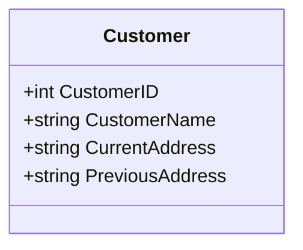

## Overview

The Slowly Changing Dimension Type 3 (SCD3) pattern is a common technique in dimensional modeling. It addresses scenarios where it is necessary to track changes to certain attribute values over time, without creating a full historical record. SCD3 achieves this by adding columns to the dimension table that store only a limited history of changes, usually by keeping both the current and previous value of the attribute.

## Design Pattern Details

### Characteristics

- **Limited History**: SCD3 is used when only a limited amount of history needs to be captured—for instance, the previous and current values.
- **Denormalization**: This approach adds redundancy to your schema by introducing additional columns to handle historical data.
- **Simplicity**: Easy to implement and requires fewer resources than SCD Type 2, but at the cost of not tracking comprehensive history.

### When to Use SCD3

- When tracking a limited history is sufficient for analytical purposes.
- When the number of updates is relatively low, minimizing column proliferation.
- In scenarios where business processes only require comparisons against the most recent historical value.

## Example Implementation

Consider a `Customer` dimension table that needs to track changes to the `CustomerAddress`. We can add a `PreviousAddress` column alongside the existing `CurrentAddress` column:

```sql
CREATE TABLE Customer (
    CustomerID INT PRIMARY KEY,
    CustomerName VARCHAR(100),
    CurrentAddress VARCHAR(255),
    PreviousAddress VARCHAR(255)
);
```

When a customer's address changes, you update the `PreviousAddress` with the current value of `CurrentAddress` and then set the new `CurrentAddress` value.

### Updating Address Example

```sql
UPDATE Customer
SET PreviousAddress = CurrentAddress,
    CurrentAddress = '123 New Street, New City'
WHERE CustomerID = 101;
```

## Diagrams

### UML Class Diagram



## Related Patterns

- **Slowly Changing Dimension Type 1 (SCD1)**: Simply overwrite old data with new data, no history is kept.
- **Slowly Changing Dimension Type 2 (SCD2)**: Maintain a complete historical record by adding new rows for each change without overwriting existing data.

## Best Practices

- Ensure that the extra columns added do not grow extensively; limit tracking to key attributes that need comparisons.
- Clearly define use cases where tracking is necessary to avoid cluttering the schema with redundant historical tracking.
- Use SCD3 as part of a broader data strategy that might also include SCD1 or SCD2 depending on the need for historical depth.

## Additional Resources

- *The Data Warehouse Toolkit* by Ralph Kimball – for an extensive exploration of dimension modeling strategies.
- Azure and AWS documentation – for optimizing data warehousing solutions using cloud-native designs.

## Summary

Slowly Changing Dimension Type 3 (SCD3) offers a middle-ground solution for tracking changes in data attributes. It is ideal for capturing limited historical states with a straightforward schema alteration. SCD3 is optimal when the history depth requirement is low, enhancing reporting capabilities while keeping storage and complexity manageable. In designing data models, choosing between SCD types involves balancing the need for historical accuracy against storage and performance considerations.
