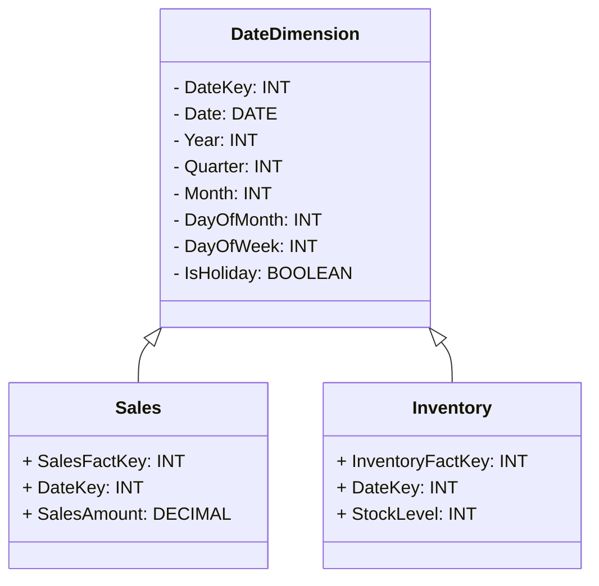

## Conformed Dimensions

### Description
Conformed dimensions are key structures within a data warehouse architecture and are used consistently across different areas of an organization's analytical systems. This pattern involves creating dimensions that retain consistent meanings and definitions when used in association with multiple fact tables and data marts. By doing so, they enable standardized reporting and analysis, ensuring uniformity and reducing ambiguity in business intelligence processes.

### Architectural Approach

- **Standardization**: Conforming dimensions requires careful standardization of definitions, attributes, keys, and hierarchies. This ensures that the same dimension, like "Date," means the same thing across the "Sales" and "Inventory" schemas.

- **Centralized Design**: Often, conformed dimensions are designed in a centralized manner to maintain consistency. Once the definitions are set, they are propagated to various data marts or schemas.

- **Data Governance**: Implementing conformed dimensions usually requires strong data governance policies to maintain consistency over time. It ensures ongoing alignment with business terms and definitions.

### Best Practices

1. **Define and Document**: Clearly define dimension attributes and hierarchies upfront, and maintain thorough documentation to guide users and developers.

2. **Change Management**: Implement robust procedures to manage changes in dimension definitions and to propagate those changes consistently across all affected systems.

3. **Data Quality**: Regularly monitor data quality to ensure that all systems using conformed dimensions have access to consistent and accurate data.

4. **Cross-Functional Teams**: Foster collaboration among cross-functional teams, including business analysts and technical staff, to ensure conformed dimensions meet all business requirements.

### Example Code

Here's a simplified example of how a conformed "Date" dimension could be represented in SQL for consistency across several datasets:

```sql
CREATE TABLE DateDimension (
    DateKey INT PRIMARY KEY,
    Date DATE NOT NULL,
    Year INT NOT NULL,
    Quarter INT NOT NULL,
    Month INT NOT NULL,
    DayOfMonth INT NOT NULL,
    DayOfWeek INT NOT NULL,
    IsHoliday BOOLEAN DEFAULT FALSE
);

-- Shared across the Sales and Inventory schemas
```

### Diagrams



### Related Patterns

- **Data Warehouse Bus Architecture**: Conformed dimensions play a critical role in the establishment of a data warehouse bus architecture, promoting the integration of data marts.

- **Star Schema**: Conformed dimensions are central to designing star schemas where a dimension is reuse across different star schemas.

### Additional Resources

- **Books**: "The Data Warehouse Toolkit" by Ralph Kimball provides comprehensive insights into conformed dimensions and their roles in a data warehouse environment.

- **Online Articles**: Numerous online resources delve into the nuances of conformed dimensions, exploring challenges and strategies for effective implementation.

### Summary

Conformed dimensions are essential for maintaining consistency and promoting integration across various components of a data warehousing system. They ensure that any analytical outcome, filtered by these dimensions, presents a consistent and reliable view of the business for informed decision-making. Designing and managing conformed dimensions requires careful planning, governance, and collaboration across the entire organization to reap the benefits of standardized reporting and analytics.
