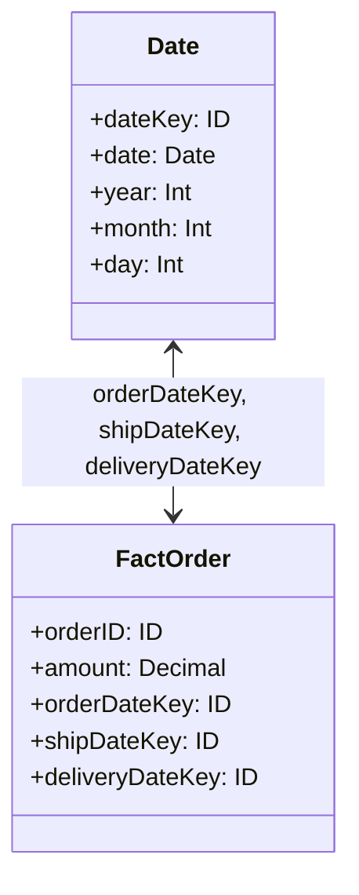

## Introduction to Role-Playing Dimension

In dimensional modeling for data warehouses, the role-playing dimension pattern plays a crucial role in simplifying and optimizing the design. This design pattern involves using one physical dimension table in multiple different contexts or roles within the fact tables, allowing for reuse and consistency across the data model.

## Description

Role-Playing Dimensions allow a single dimension, such as a "Date," to be applied in multiple parts of a data model. Instead of creating multiple separate dimensions for each context where a "Date" is needed—like "OrderDate," "ShipDate," "DeliveryDate"—you can define a single "Date" dimension. This single dimension is then referenced multiple times in different parts of the fact tables to serve various purposes, achieving consistency and reducing redundancy.

### Key Components

- **Physical Dimension Table**: A single table that provides numerous logical roles by being associated with various contexts within different fact tables.
- **Aliases**: A method to differentiate the multiple usages of the same physical dimension. Each usage is treated as an alias in different fact tables.
- **Fact Tables**: Utilize these dimension aliases to record and manage separate events or actions represented by those dimensions.

## Example Use Case

Imagine a retailer managing their order data. They need to track:

- The date an order was placed.
- When the order was shipped.
- When the order was delivered.

Rather than creating a separate dimension table for each of these dates, they employ the "Date" dimension as a role-playing dimension:

- **OrderDate**
- **ShipDate**
- **DeliveryDate**

Here's a simplified example with schema diagrams:

## Best Practices

1. **Consistency in Naming**: Clearly define the roles by consistent and meaningful aliases for dimensions within your fact tables.
2. **Scalable Design**: Plan for scalability by anticipating additional roles that may arise as data needs evolve.
3. **Documentation**: Maintain thorough documentation to ensure all role-playing uses of a dimension are clear to future developers and analysts.

## Related Patterns

- **Conformed Dimension**: Integrating multiple data sources by ensuring dimensions have consistent meaning.
- **Junk Dimension**: A combination of typically small dimensions such as flags or indicators into a single dimension.
  
## Additional Resources

- [The Data Warehouse Toolkit: The Definitive Guide to Dimensional Modeling](https://www.amazon.com/Data-Warehouse-Toolkit-Definitive-Dimensional/dp/1118530802) by Ralph Kimball and Margy Ross
- Online resources and forums like Stack Overflow and various data modeling groups for peer support.

## Summary

The role-playing dimension pattern is pivotal for efficient data warehouse design. It ensures flexibility and consistency by allowing one physical dimension table to serve multiple contextual purposes within fact tables, helping streamline ETL processes and maintain coherence across data models. By understanding and effectively implementing this pattern, organizations can enhance their data analytics capabilities while minimizing redundancy and complexity.
