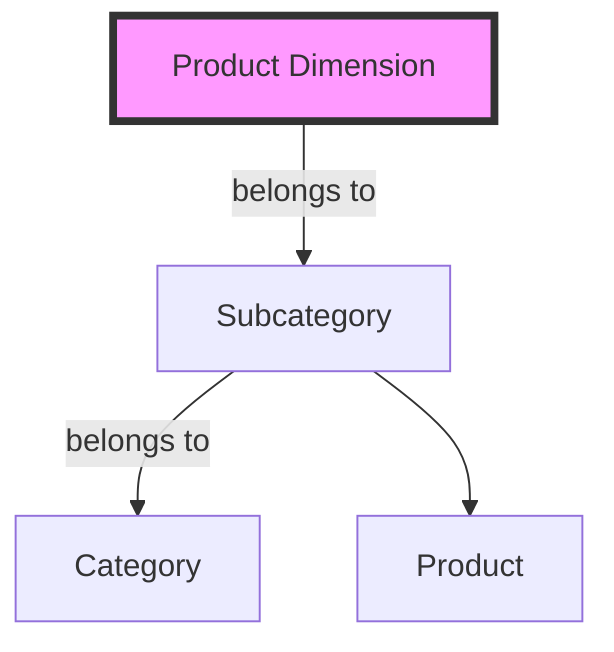

## Hierarchies in Dimensions

### Description
Hierarchies in dimensions refer to the representation of data in a multi-level or nested format within a dimension of your data model. This is important in data warehousing and business intelligence environments where understanding hierarchical relationships, such as categories and subcategories, is crucial for data analysis and reporting. Hierarchies allow for roll-up or drill-down capabilities in OLAP (Online Analytical Processing) cubes, enabling more flexible and powerful analysis.

### Architectural Approaches 

Implementing hierarchies typically involves organizing the dimension tables such that each level in the hierarchy can be traversed easily. Common practices include:

- **Ragged Hierarchies**: These do not have uniform levels. For example, different products levels can have varying numbers of categories or subcategories.
- **Balanced Hierarchies**: All leaf nodes are at the same level. This is simpler to manage and more predictable for querying.
- **Unbalanced Hierarchies**: Allow for different depths of subordinate data.
  
### Best Practices

1. **Maintain Simplicity**: Keep hierarchies as straightforward as possible to facilitate ease of analysis.
2. **Use Surrogate Keys**: Opt for surrogate keys over natural keys to ensure uniqueness and simplify joins.
3. **Normalize Sparsely Populated Hierarchies**: This can help in managing varying levels within a dimension effectively.
4. **Index Strategically**: Ensure appropriate indexing to optimize query performance across hierarchical data.
5. **Security Considerations**: Implement role-based access control if different hierarchy levels contain sensitive information.

### Example Code

Here is an example schema design for a "Product" dimension with hierarchical categories:

```sql
CREATE TABLE ProductDimension (
    ProductID INT PRIMARY KEY,
    ProductName VARCHAR(255),
    SubcategoryID INT,
    SubcategoryName VARCHAR(255),
    CategoryID INT,
    CategoryName VARCHAR(255)
);
```

### Diagrams



### Related Patterns and Descriptions

- **Star Schema**: Involves dimensional tables like hierarchies directly connected to the fact table.
- **Snowflake Schema**: Hierarchical levels are split into separate tables to normalize the structure of the hierarchy.
- **Slowly Changing Dimension (SCD)**: Combines with hierarchies to manage changes in hierarchical structure over time.

### Additional Resources

- **Kimball Dimensional Modeling**: Considered foundational in the discipline of data warehousing, providing comprehensive approaches to modeling data.
- **ETL Tools and Techniques**: Data integration processes that often deal directly with maintaining dimensional hierarchies.
- **OLAP Cube Structures**: For insights on how OLAP structures consume hierarchical dimensions.

### Summary

Hierarchies in dimensions are crucial for organizing data in a way that supports rich and varied data analytics. By implementing dimensional hierarchies, organizations can achieve more efficient data retrieval, improve the intuitiveness of their reports, and support complex analytical queries. Correct handling of hierarchically structured data is key to unlocking the full potential of business intelligence technologies.
