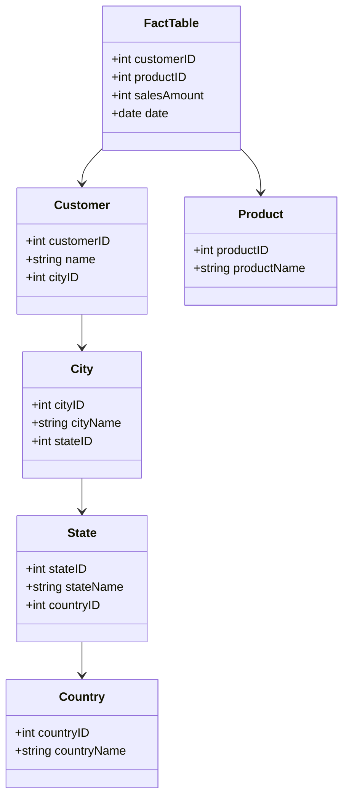

## Introduction

The Snowflake Schema is a logical arrangement of data in a relational database in which the logical structure resembles a snowflake shape. It is a more complex variant of the star schema and is used in data warehousing to improve the organization and reduce redundancy by normalizing dimension tables into multiple related tables.

## Detailed Explanation

### Architectural Approach

The Snowflake Schema normalizes the dimension tables, breaking them down into additional subtables. This normalization is achieved by creating a set of smaller, related tables that represent the hierarchy and attributes of the dimension tables in more detail.

For instance, consider a "Customer" dimension in a star schema, which might contain all customer information in one table. In a snowflake schema, this "Customer" dimension could be divided into:

- A main "Customer" table
- A "City" table linked to the "Customer" table
- A "State" table linked to the "City" table
- A "Country" table linked to the "State" table

### Advantages

1. **Data Integrity**: Normalizing dimension tables ensures consistency across the data warehouse and eliminates data redundancy.
2. **Reduced Storage**: By breaking down dimensions into hierarchies, the snowflake schema may reduce the storage requirements compared to a star schema.
3. **Improved Query Performance with Specialized Indexes**: While standard queries may be slower, the use of specific indexes or query engines optimized for handling such normalized schemas can benefit performance.

### Disadvantages

1. **Complex Queries**: The increased number of joins due to normalized structure can degrade query performance.
2. **Loading Complexity**: Data loading can become more complex, as relationships between tables have to be preserved and managed during ETL processes.
3. **Maintenance Overhead**: More tables mean more complexity in maintenance, which can be a concern for scaling and evolving schemas.

### Diagram

Here is a simple representation of a Snowflake Schema using a Mermaid class diagram:

## Best Practices

1. **Identify Natural Hierarchies**: Normalize dimension tables by identifying natural hierarchies within the data, such as geography or time.
2. **Index Strategically**: Use indexes to improve performance on frequent search and join operations. Consider indexing foreign keys that are used in joins.
3. **ETL Optimization**: Optimize ETL processes to efficiently manage the loading and updating of related dimension tables.
4. **Pre-aggregate Tables**: Use pre-aggregated tables to speed up queries that require complex joins over multiple tables.

## Related Patterns

1. **Star Schema**: A simpler, denormalized form of schema which includes one central fact table connected directly to dimension tables.
2. **Galaxy Schema**: Also known as a fact constellation schema, it links multiple fact tables sharing dimension tables.

## Additional Resources

- [Dimensional Modeling: In a Business Intelligence Environment](https://www.amazon.com/Dimensional-Modeling-Business-Intelligence-Environment/dp/0470223559) - A book offering extensive details on data modeling techniques.
- [Data Warehouse Toolkit](https://www.amazon.com/Data-Warehouse-Toolkit-Definitive-Dimensional/dp/1118530802) - A guide by Ralph Kimball on building effective data warehouses.

## Summary

The Snowflake Schema provides a normalized structure to dimension data, promoting data integrity and potentially reducing storage needs. However, this comes at the cost of complex queries and maintenance overheads. Effective usage of this design involves strategic indexing, optimized ETL processes, and understanding the trade-offs between normalization benefits and query performance.
