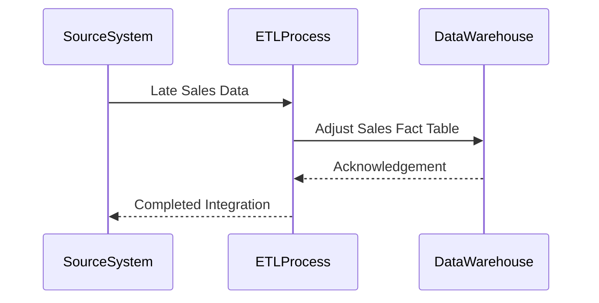

In a robust data warehousing environment, data accuracy and timeliness are critical. However, in practice, data can often arrive late due to delays in operational source systems or transmission errors. The **Late Arriving Facts** design pattern addresses the challenge of how to correctly integrate these tardy records into the data warehouse without compromising the integrity and continuity of analytics operations.

## Detailed Explanation

Late arriving facts refer to transactional data that arrives after the expected time window for data integration. These can include sales transactions reported late, retrospective corrections, or any kind of operational data not promptly captured due to delays. The fundamental challenge is ensuring these delayed records are correctly inserted into historical periods, maintaining the timeline's continuity.

### Architectural Approaches

1. **Backdating of Facts**: 
    - Insert the late arriving fact into the historical time period it actually belongs to, adjusting any aggregates or summaries previously calculated.

2. **Reprocessing with a Time-Lagged Approach**:
    - Implement a lag period where data is expected to stabilize. Daily processing might be delayed by a few days, allowing for corrections before reporting.

3. **Handling with Revised Aggregates**:
    - Maintain a correction layer, where late records correct aggregated summaries or KPIs. Real-time analytics pipelines like Apache Kafka Streams can be employed for such tasks.

### Example Code

Below is a basic ETL transformation logic for inserting late arriving sales data in a SQL-based data warehouse.

```sql
MERGE INTO sales_fact t
USING incoming_late_sales i
ON (t.sale_id = i.sale_id)
WHEN MATCHED THEN
    UPDATE SET t.amount = i.amount, t.updated_at = CURRENT_TIMESTAMP
WHEN NOT MATCHED THEN
    INSERT (sale_id, customer_id, product_id, sale_date, amount)
    VALUES (i.sale_id, i.customer_id, i.product_id, i.sale_date, i.amount);
```

This script merges incoming sales data that is late with the existing sales facts adding or updating records as necessary.

### UML Sequence Diagram



### Related Patterns

- **Late Arriving Dimensions**: Handles late incoming attributes for dimension tables.
- **Slowly Changing Dimensions**: Manages gradual changes in dimension attributes over time.
  
### Additional Resources

- Ralph Kimball's Data Warehouse Toolkit (for deeper insights on dimensional modeling patterns)
- Modern Data Warehousing architectures (exploring microservices and cloud data platforms)
- Real-time Stream Processing with Apache Kafka

## Summary

The Late Arriving Facts pattern is crucial for maintaining the historical accuracy and reliability of data warehouses in the face of tardy data. By carefully backdating such records and adjusting aggregations, data warehouses can maintain consistency while supporting accurate historical analyses. Employing tools and strategies for handling late data can greatly improve data quality assurance and ensure dependable business intelligence capabilities.

This pattern is integral to any enterprise seeking to manage their data assets responsibly, providing resilience against unexpected delays inherent in complex operational environments.
