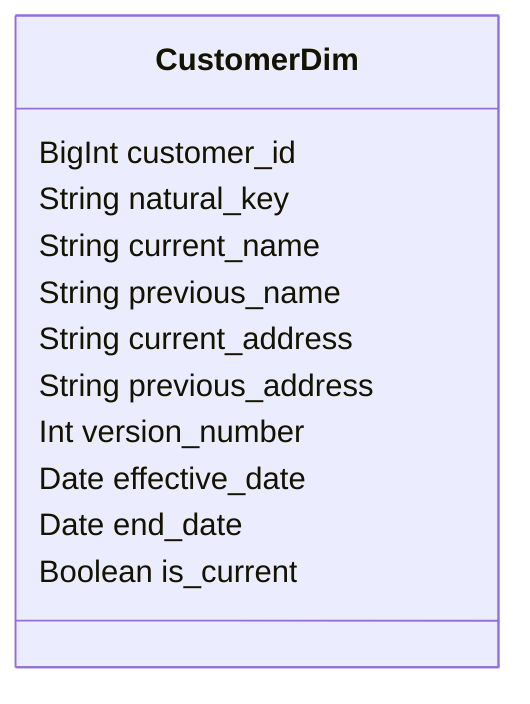

## Overview
The Type 6 Slowly Changing Dimension (SCD) pattern is a sophisticated approach to managing dimension table changes in a data warehouse environment. It combines the principles of SCD Types 1, 2, and 3 to provide a comprehensive system for tracking changes in both historical and current data records within a single dimension table. This hybrid approach is instrumental in maintaining both a complete history of changes and efficient access to current data.

## Architectural Approach
Type 6 SCDs address the limitations of individual SCD types by integrating their attributes:
- **Type 1** updates overwrite existing data with new values, focusing on maintaining current data quality.
- **Type 2** adds new rows for changes, preserving the full history of changes.
- **Type 3** implements additional columns to reflect prior states, allowing limited history tracking.

In a Type 6 implementation, you typically maintain:
- Natural keys and surrogate keys for referential integrity.
- Current and previous values within different columns.
- Record versioning systems to ensure complete chronological order.
- Logical flags for active/inactive statuses of records.

## Best Practices 
- **Defining Surrogate Keys**: Ensure each record maintains a unique identifier distinct from the natural key.
- **Normalize Column Naming**: Standardize column names for tracking previous values to facilitate consistency and understanding. For example, `previous_<attribute_name>`.
- **Timestamp and Version Columns**: Include timestamps and versioning to support chronological queries and simplify ETL processes.
- **Efficient Indexing**: Implement strategic indexing for optimal query performance on key attributes, especially those frequently involved in change tracking.

## Example Code

Here is a simplified SQL schema illustrating Type 6 SCD implementation:

```sql
CREATE TABLE customer_dim (
    customer_id BIGINT PRIMARY KEY,
    natural_key VARCHAR(255) NOT NULL,
    current_name VARCHAR(255),
    previous_name VARCHAR(255),
    current_address VARCHAR(255),
    previous_address VARCHAR(255),
    version_number INT,
    effective_date DATE,
    end_date DATE,
    is_current BOOLEAN
);
```

In this schema:
- `natural_key` represents the unique handling ID for quick identification.
- `current_name` and `previous_name` are used to implement Type 1 and 3 features.
- `version_number` and `is_current` apply Type 2 strategies for maintaining changes history.
- `effective_date` and `end_date` track the temporal aspect of the data validity.

## Visualization



## Related Patterns
- **SCD Type 1**: Updates overwrite existing values without maintaining any history.
- **SCD Type 2**: Inserts new records with each change, preserving full history with overlap.
- **SCD Type 3**: Uses additional columns for previous data states, enabling limited history tracking.

## Additional Resources
- *Data Warehouse Toolkit* by Ralph Kimball for comprehensive methods on data warehouse design and management.
- Industry white papers and journals on dimensional modeling best practices.

## Summary
The Type 6 Slowly Changing Dimension pattern is an advanced hybrid model that successfully integrates the functionalities of Type 1, 2, and 3 SCDs into one cohesive design. This pattern stands out by offering a detailed method for managing both current data states and historical records while supporting efficient querying and reporting capabilities in data warehouses. Its thoughtful employment ensures balanced adaptation to evolving business requirements and analytical needs.
