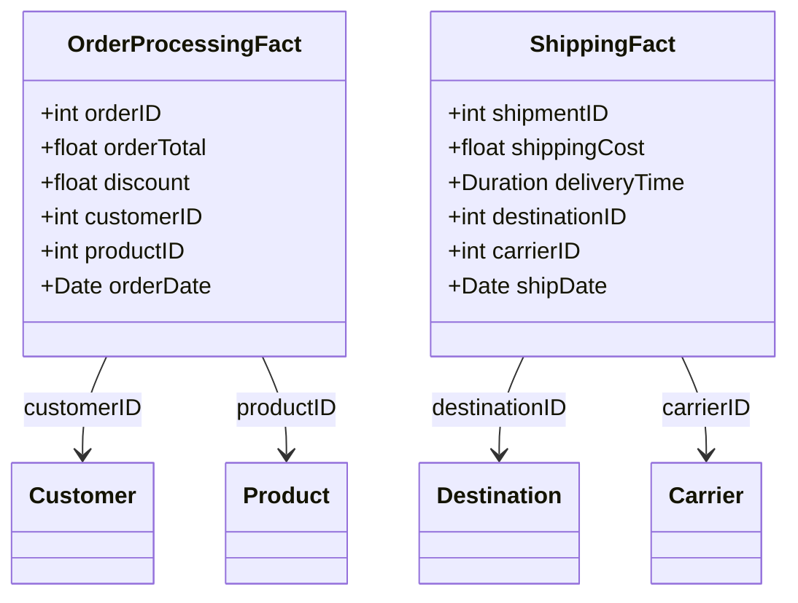

## Introduction

Business Process Modeling is a critical dimensional modeling pattern used in data warehousing and analytics. The pattern focuses on aligning data structures with organizational business processes to facilitate accurate and insightful reporting. By structuring fact tables according to business processes, businesses can achieve a cleaner architecture and streamline both operational efficiencies and strategic decision-making.

## Architectural Approach

Business Process Modeling involves creating separate fact tables for distinct business processes. Each fact table is designed to encapsulate the key performance metrics and attributes specific to a particular business process. This separation ensures that data remains organized, queries are optimized for performance, and complexity is reduced when mapping business logic to data structures.

### Key Considerations

- **Process Identification**: Identify all business processes within the organization. This step involves collaboration with business stakeholders to determine the core activities that drive business operations.
  
- **Fact Table Design**: For each process, design fact tables that contain the measurable quantities and dimensions pertinent to that process. Ensure the granularity of the fact tables aligns with the information needed for decision-making.

- **Data Integration**: Integrate data from disparate sources to populate these fact tables. These sources can include transactional systems, third-party feeds, and more.

## Example: Order Processing and Shipping

Consider an e-commerce company that needs to analyze two core processes: order processing and shipping.

1. **Order Processing Fact Table**:
   - Measures: Order count, order total, discounts applied
   - Dimensions: Customer, product, order date, sales rep

2. **Shipping Fact Table**:
   - Measures: Shipping cost, delivery time
   - Dimensions: Destination, shipping carrier, ship date

These separate fact tables help capture the nuance specific to each process, allowing for targeted analysis and optimizations.

## Diagram

Here is a conceptual UML class diagram using Mermaid to illustrate the relationship between an order processing fact table and a shipping fact table.

## Best Practices

- **Scalability**: Design fact tables to handle future business process changes or additions.
  
- **Modularity**: Keep process fact tables modular to simplify maintenance and enhancement.

- **Consistency**: Ensure consistency in naming conventions and data types across fact tables to facilitate easier ETL (Extract, Transform, Load) processes.

## Related Patterns

- **Transactional Fact Tables**: Complement B*usiness Process Modeling by capturing detailed, low-level data at the transaction level.
- **Event-Driven Architecture**: Leverage events in your process modeling to create real-time, responsive analytical capabilities.

## Additional Resources

- Ralph Kimball's Data Warehouse Toolkit: Provides insights into dimensional modeling for various business processes.
- The DAMA-DMBOK Guide: A comprehensive resource on data management principles including modeling patterns.

## Summary

Business Process Modeling is a proven design pattern that enhances the line of alignment between a data warehouse and the business processes it represents. This structured approach allows organizations to derive significant analytical value and insights from their data, tailored closely to their operational and strategic needs. Decoupling fact tables by business processes not only aids in performance optimization but also simplifies complex decision-making processes.
