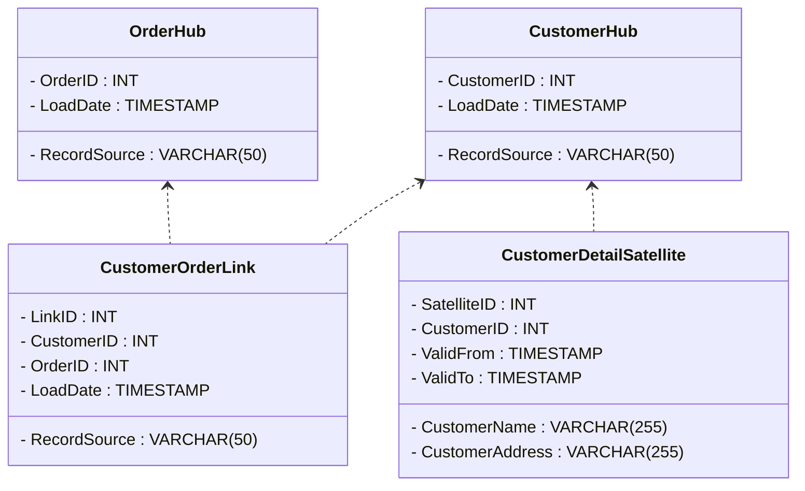

---

linkTitle: "Data Vault Modeling"
title: "Data Vault Modeling"
category: "2. Dimensional Modeling Patterns"
series: "Data Modeling Design Patterns"
description: "A modeling approach emphasizing flexibility, scalability, and auditability using hubs, links, and satellites."
categories:
- Advanced Modeling
- Data Warehousing
- Scalability Patterns
tags:
- Data Modeling
- Data Vault
- Hubs
- Links
- Satellites
date: 2024-07-07
type: docs

canonical: "https://softwarepatternslexicon.com/102/2/28"
license: "© 2024 Tokenizer Inc. CC BY-NC-SA 4.0"
---


## Introduction

Data Vault Modeling is a data modeling methodology primarily used to build enterprise data warehouses. It focuses on providing long-term historical storage of data originating from multiple sources with full traceability and auditability. It breaks down into three core components: Hubs, Links, and Satellites, each serving a specific purpose in the schema.

## Core Components

### Hubs

Hubs represent the core business entities. They store a unique list of business keys with metadata such as load date and record source. Hubs are foundational to the data vault model because they capture the history of business key changes over time without losing integrity.

- **Example**: A "CustomerHub" might store unique customer IDs and metadata related to their entry into the system.

### Links

Links associate Hubs, capturing relationships between core business entities. They are designed for many-to-many relationships and allow flexibility in joining different parts of the data model. Each link can relate multiple hubs and contain additional descriptive attributes.

- **Example**: A "CustomerOrderLink" might connect the "CustomerHub" and "OrderHub," outlining which customers have placed which orders.

### Satellites

Satellites are where the descriptive attributes of Hubs and Links are stored. Used to track the historical changes of the data and loaded with timestamps, Satellites allow temporal queries and in-depth analysis by preserving historical data.

- **Example**: A "CustomerDetailSatellite" could hold details like customer name and address, which may change over time.

## Architectural Approaches

### Flexibility

Data Vault's decoupling of data entities through Hubs, Links, and Satellites fosters a modular architecture. This ensures that changes in source systems exert minimal impact, facilitating seamless integration of new data sources.

### Scalability

The schema's design allows parallel loading processes. Since different entities and relations are stored separately, data vaults can efficiently handle increasing data volume and complexity.

### Auditability

Every piece of data in the system is traceable back to its source. By capturing metadata such as load date and source of record, Data Vaults enable detailed audits and compliance with regulations for data traceability.

## Example Code

Here's an outline of how the schema for a simple data vault model might be implemented in SQL:

```sql
CREATE TABLE CustomerHub (
    CustomerID INT PRIMARY KEY,
    LoadDate TIMESTAMP,
    RecordSource VARCHAR(50)
);

CREATE TABLE OrderHub (
    OrderID INT PRIMARY KEY,
    LoadDate TIMESTAMP,
    RecordSource VARCHAR(50)
);

CREATE TABLE CustomerOrderLink (
    LinkID INT PRIMARY KEY,
    CustomerID INT,
    OrderID INT,
    LoadDate TIMESTAMP,
    RecordSource VARCHAR(50),
    FOREIGN KEY (CustomerID) REFERENCES CustomerHub(CustomerID),
    FOREIGN KEY (OrderID) REFERENCES OrderHub(OrderID)
);

CREATE TABLE CustomerDetailSatellite (
    SatelliteID INT PRIMARY KEY,
    CustomerID INT,
    CustomerName VARCHAR(255),
    CustomerAddress VARCHAR(255),
    ValidFrom TIMESTAMP,
    ValidTo TIMESTAMP,
    FOREIGN KEY (CustomerID) REFERENCES CustomerHub(CustomerID)
);
```

## Diagrams

Here is a high-level overview of the Data Vault Modeling components using a Mermaid UML diagram:



## Related Patterns and Further Reading

- **Pattern**: [Star Schema](linkToAnotherDoc) - a very different approach aiming at straightforward OLAP functions.
- **Pattern**: [Snowflake Schema](linkToAnotherDoc) - a normalization of the Star schema approach.

### Additional Resources

1. **Book**: "Building a Scalable Data Warehouse with Data Vault 2.0" by Dan Linstedt & Michael Olschimke.
2. **Website**: [datavaultalliance.com](https://www.datavaultalliance.com)
3. **Video**: Introductory sessions on data vault modeling at tech conferences.

## Summary

Data Vault Modeling offers a robust way to construct and manage a data warehouse, particularly within environments where flexibility, scalability, and auditability are paramount. By decomposing data into Hubs, Links, and Satellites, it's possible to handle evolving data sources and changing requirements without losing historical accuracy, making it a vital tool for modern data architecture needs.
