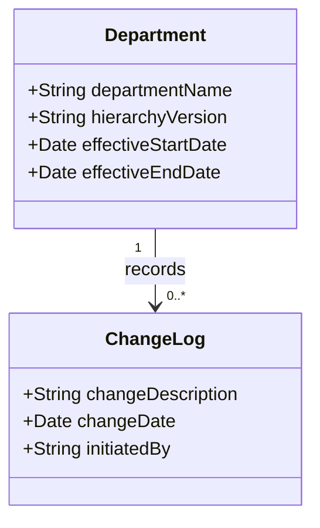

## Overview

In the realm of data warehousing, maintaining the integrity and historical accuracy of hierarchical structures is crucial, especially when these structures change over time. The "Handling Slowly Changing Hierarchies" design pattern addresses the management and modeling approaches needed to track and adapt to changes in hierarchies.

Hierarchies can include organizational structures, product classifications, and geographical mappings, among others. Changes to these structures pose unique challenges as they can affect reporting, historical data comparison, and downstream analysis.

## Problem Statement

Hierarchical structures in dimensions often need updating due to reorganizations, mergers, acquisitions, categorization changes, etc. The challenge lies in aligning these changes with historical data for accurate reporting and analysis without losing historical context.

## Solution

The "Handling Slowly Changing Hierarchies" pattern involves two primary strategies:

1. **Versioned Hierarchies**: Each change in the hierarchy results in a new version of the entire hierarchy structure. This method enables easy retrieval of historical views as they were known at any point in time.

2. **Effective-Dated Relationship Table**: Here, each change is managed through effective date ranges. This approach involves maintaining a table that records parent-child relationships with their valid time intervals for accurate join operations when querying historical data.

### Key Components

- **Surrogate Keys**: Use surrogate keys in dimension tables for stable, unique identification across changes.
  
- **Change Tracking Attributes**: Attributes such as effective start and end dates signify the valid period for a hierarchical relationship in the data structure.

## Best Practices

- **Automate**: Use ETL processes to automate the tracking and application of changes in hierarchies.
  
- **Consistent Auditing**: Maintain logs of changes to hierarchies to address discrepancies and validate historical reports.
  
- **Documentation**: Keep thorough documentation on change rationales and transformation logic, especially when there are major hierarchy overhauls.

## Example

Consider an organization dimension where a company frequently restructures its departments. Applying the versioned hierarchy pattern, the dimension's table would include:

| Org_ID | Department_Name | Hierarchy_Version | Effective_Start_Date | Effective_End_Date |
|--------|-----------------|-------------------|----------------------|--------------------|
| 1      | Sales           | v1                | 2020-01-01           | 2021-12-31         |
| 2      | Marketing       | v1                | 2020-01-01           | 2021-12-31         |
| 3      | Sales & Marketing | v2              | 2022-01-01           | NULL               |

Here, the organization shifted Sales and Marketing under a single department: "Sales & Marketing" starting from 2022.

## Diagram

## Related Patterns

- **Slowly Changing Dimensions (SCD)**: A broader pattern managing changing data attributes over time.
- **Snapshot Pattern**: Captures complete states of data at specific points in time, useful in managing hierarchical data.

## Additional Resources

- "The Data Warehouse Toolkit: The Definitive Guide to Dimensional Modeling" by Ralph Kimball.
- Online courses and resources on data warehousing and ETL processes, focusing on handling complex hierarchies.

## Summary

Handling Slowly Changing Hierarchies is crucial for maintaining accurate historical data integrity in data warehouses. By utilizing strategies such as versioned hierarchies and effective-dated relationship tables, organizations can manage changes effectively. Incorporating best practices such as automation and consistent auditing ensures reliable data management over time. Understanding and implementing these techniques are essential skills for data professionals working in complex data environments.
