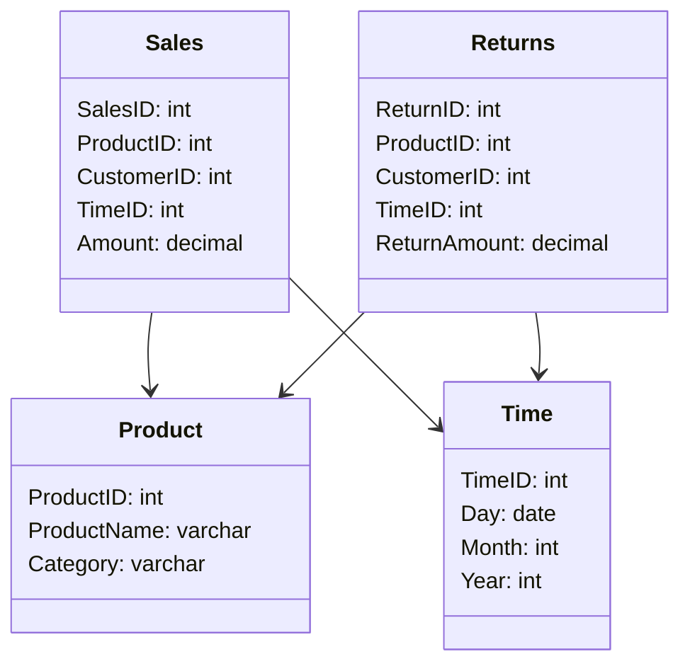
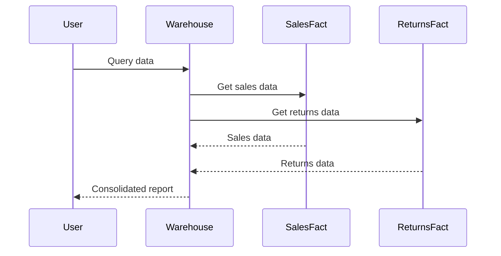

---

linkTitle: "Galaxy Schema (Fact Constellation)"
title: "Galaxy Schema (Fact Constellation)"
category: "Dimensional Modeling Patterns"
series: "Data Modeling Design Patterns"
description: "An advanced schema design, the Galaxy Schema or Fact Constellation, leverages multiple fact tables that share dimension tables, enabling the representation of complex data models and supporting sophisticated analytical processes."
categories:
- data-modeling
- dimensional-modeling
- schema-design
tags:
- galaxy-schema
- fact-constellation
- data-warehousing
- dimensional-tables
- data-analysis
date: 2024-07-07
type: docs

canonical: "https://softwarepatternslexicon.com/102/2/3"
license: "© 2024 Tokenizer Inc. CC BY-NC-SA 4.0"
---


The Galaxy Schema, also known as a Fact Constellation, is a sophisticated database schema used in data warehousing. It involves multiple fact tables that share common dimension tables. This design allows for the efficient representation of complex data models and facilitates in-depth analysis of multi-faceted datasets.

## Detailed Explanation

### Characteristics

- **Multiple Fact Tables**: The Galaxy Schema consists of more than one fact table, which allows it to store different areas of business processes or different events.
  
- **Shared Dimensions**: These fact tables utilize common dimensions, reducing redundancy and enabling a unified view across various fact datasets.

- **Complex Relationships**: Due to its architecture, this schema is well-suited for complex relationships between different datasets, supporting extensive querying capabilities.

### Architecture

- **Fact Tables**: Store quantitative data for analysis, such as sales figures or return rates. Each fact table in a galaxy schema represents a distinct business process or set of events.
  
- **Dimension Tables**: Provide descriptive attributes related to fact data, such as 'Product', 'Time', 'Customer', etc. Dimensions are designed to be reused across multiple fact tables.

### Use Case Example

Consider a retail business:

- **Fact Tables**:
  - `Sales`: Captures transaction data such as amount sold, date of transaction.
  - `Returns`: Tracks the details of returned items.

- **Dimension Tables**:
  - `Product`: Contains product details like name, category, price.
  - `Time`: Holds temporal data like day, month, year.

Both fact tables share the `Product` and `Time` dimensions, offering a consolidated view of sales and returns analytics.

## Example Code

Here's a SQL example illustrating a simple Galaxy Schema setup:

```sql
CREATE TABLE Sales (
    SalesID INT PRIMARY KEY,
    ProductID INT,
    CustomerID INT,
    TimeID INT,
    Amount DECIMAL
);

CREATE TABLE Returns (
    ReturnID INT PRIMARY KEY,
    ProductID INT,
    CustomerID INT,
    TimeID INT,
    ReturnAmount DECIMAL
);

CREATE TABLE Product (
    ProductID INT PRIMARY KEY,
    ProductName VARCHAR(255),
    Category VARCHAR(255)
);

CREATE TABLE Time (
    TimeID INT PRIMARY KEY,
    Day DATE,
    Month INT,
    Year INT
);
```

## Diagrams

### UML Class Diagram



### Sequence Diagram



## Related Patterns

- **Star Schema**: Utilizes a single large central fact table and star-like connections with dimension tables.
- **Snowflake Schema**: Similar to a star schema, but uses normalized dimension tables.

## Best Practices

- **Consistency in Dimensions**: Ensure dimension tables remain consistent across different fact tables.
- **Efficient Indexing**: Implement indexing to optimize query performance across fact tables.

## Additional Resources

- "The Data Warehouse Toolkit" by Ralph Kimball
- [Understanding Data Warehousing](https://aws.amazon.com/big-data/datalakes-and-analytics/data-warehouse/)

## Summary

The Galaxy Schema excels in complex analytics by sharing dimension tables across multiple fact tables. Its design enables effective management and analysis of sophisticated datasets, thereby serving as a powerful tool for businesses requiring deep insights from their data warehouse. By understanding and implementing the Galaxy Schema, organizations can achieve refined analytical capabilities not possible with simpler schema designs.
