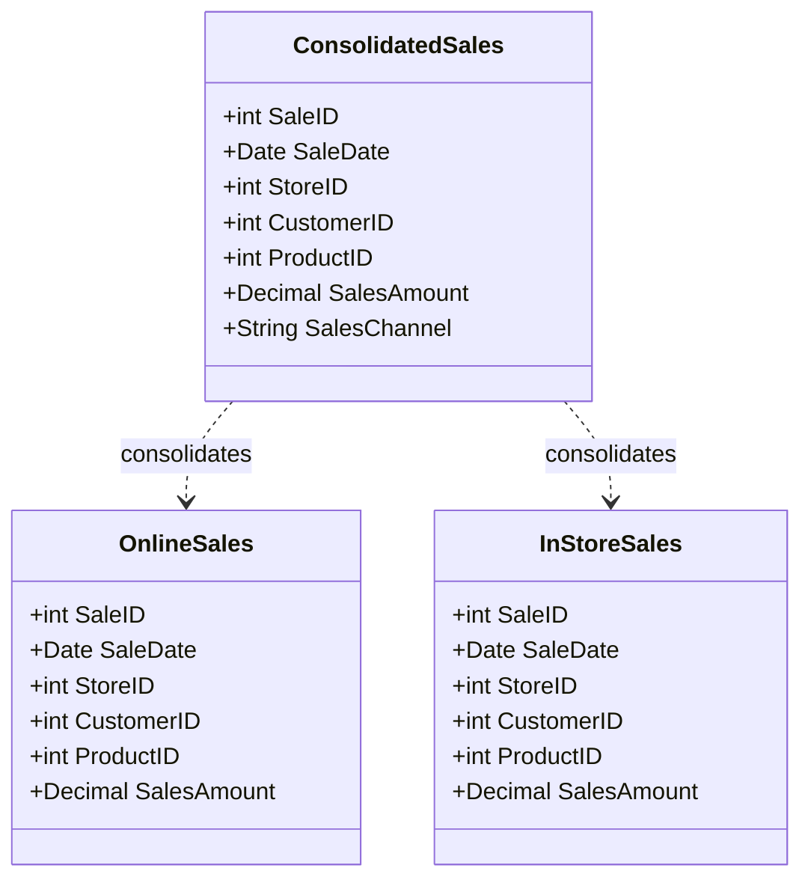

## Overview

Consolidated Fact Tables are a dimensional modeling pattern where multiple fact tables of the same grain are combined into a single table. This pattern is often used to simplify the data warehouse structure, enhance query performance, and improve manageability by unifying diverse sources of similar data into one centralized repository. A typical example is merging "OnlineSales" and "InStoreSales" fact tables into a single "Sales" fact table.

## Detailed Explanation

### Benefits

1. **Simplicity**: Reducing the number of tables simplifies the data model, making it easier for business analysts and data scientists to understand and query.
2. **Improved Performance**: Consolidation can lead to performance improvements by reducing the number of joins in queries.
3. **Centralized Management**: With a single table, data governance and quality measures can be applied uniformly.
4. **Easier Integration**: As new data sources with the same granularity emerge, they can more easily integrate into the existing fact table structure.

### Implementation Approach

1. **Identify Common Grain**: Ensure all fact tables to be consolidated share the same grain.
2. **Design Unified Schema**: Develop a schema that accommodates all data points from the original fact tables, replacing specific dimension keys if necessary.
3. **Load Data**: Apply ETL processes to transform and load data from individual tables into the consolidated table.
4. **Maintain Consistency**: Establish data validation and governance policies to maintain data integrity and consistency across consolidated sources.

### Example Code

```sql
-- Create a new consolidated fact table
CREATE TABLE ConsolidatedSales (
    SaleID INT PRIMARY KEY,
    SaleDate DATE,
    StoreID INT,
    CustomerID INT,
    ProductID INT,
    SalesAmount DECIMAL(10, 2),
    SalesChannel VARCHAR(10) -- 'Online' or 'In-Store'
);

-- Insert data from OnlineSales
INSERT INTO ConsolidatedSales (SaleID, SaleDate, StoreID, CustomerID, ProductID, SalesAmount, SalesChannel)
SELECT SaleID, SaleDate, StoreID, CustomerID, ProductID, SalesAmount, 'Online' AS SalesChannel
FROM OnlineSales;

-- Insert data from InStoreSales
INSERT INTO ConsolidatedSales (SaleID, SaleDate, StoreID, CustomerID, ProductID, SalesAmount, SalesChannel)
SELECT SaleID, SaleDate, StoreID, CustomerID, ProductID, SalesAmount, 'In-Store' AS SalesChannel
FROM InStoreSales;
```

### Mermaid UML Class Diagram



## Related Patterns

- **Fact Table Aggregation**: Enhancing query performance by pre-aggregating data.
- **Star Schema**: Structuring data with a central fact table surrounded by dimension tables.
- **Snowflake Schema**: A more normalized form of the star schema with additional complexity.

## Additional Resources

- [Kimball Group's Dimensional Modeling Techniques](https://www.kimballgroup.com)
- [The Data Warehouse Toolkit by Ralph Kimball](https://www.wiley.com/en-in/The+Data+Warehouse+Toolkit%2C+3rd+Edition-p-9781118530801)

## Summary

Consolidating fact tables into a single table at the same grain aids in simplifying the data architecture, improving query efficiency and centralizing data governance. This practical pattern is especially beneficial in environments where multiple datasets of similar structure converge, offering a unified view for analytical processes. By implementing a consolidated fact table, an organization can enhance its operational efficiency and analytics capabilities.
