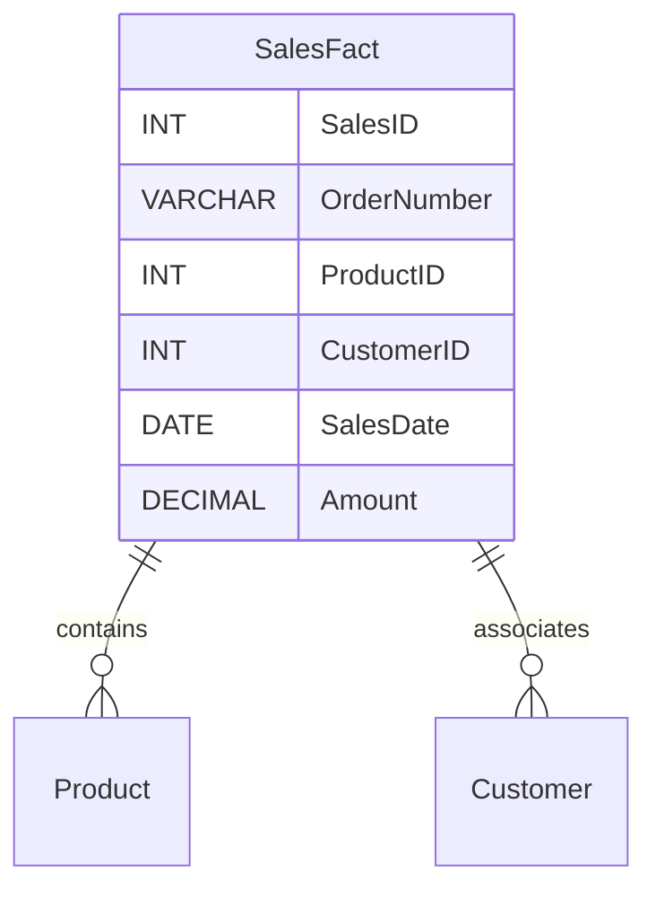

## Introduction

The concept of a Degenerate Dimension (DD) in the realm of dimensional modeling simplifies the design and storage of data systems by including transaction identifiers directly in the fact table. This pattern becomes particularly useful in scenarios where transaction numbers, such as invoice or order numbers, do not have related attributes that necessitate creating full-fledged dimensions.

## Design Pattern Overview

A degenerate dimension refers to an identifier existing in the fact table without any associated dimension table. These elements are free of additional measurable attributes and typically serve as natural keys.

### Real-Life Example

A common instance of this pattern is seen in sales data, where the "OrderNumber" acts considerably as a degenerate dimension. Instead of setting up a separate dimension table solely for storing order numbers, including them directly within the "Sales" fact table optimizes query performance and minimizes storage.

### Architectural Approach and Benefits

- **Efficiency**: By eliminating the need for separate dimension tables for singular attributes like transaction numbers, database systems experience reduced complexity and enhanced performance.
  
- **Simplicity**: Queries become simpler and faster since they don’t require joining additional tables for basic transaction details.

- **Resource Optimization**: It conserves resources by preventing the needless creation of dimension tables that would otherwise contribute scarcely to the data warehouse’s analytical function.

## Example Code

Here’s a simple SQL example demonstrating a sales fact table with a degenerate dimension:

```sql
CREATE TABLE SalesFact (
    SalesID INT PRIMARY KEY,
    OrderNumber VARCHAR(20), -- Degenerate dimension
    ProductID INT,
    CustomerID INT,
    SalesDate DATE,
    Amount DECIMAL(10, 2)
);
```

In the above case, `OrderNumber` serves as a degenerate dimension, eliminating the requirement for a distinct table.

## Diagram

Here's a simple illustration to help visualize the relationship:



## Related Patterns

- **Junk Dimensions**: Whereas degenerate dimensions are single or minimal bits of data added to the fact tables, junk dimensions collect miscellaneous low-cardinality flags and attributes.

- **Conformed Dimensions**: These are dimensions reusable among fact tables, contrasting with degenerate dimensions' singular specificity.

## Additional Resources

- Ralph Kimball's "The Data Warehouse Toolkit" offers deeper insights into dimensional modeling.
- Online courses on data warehousing and SQL performance tuning which frequently cover degenerate dimensions.

## Summary

Degenerate dimensions optimize data warehouse performance and usability by including transaction numbers directly in fact tables rather than creating separate but often unnecessary tables. By simplifying data models, they improve resource allocation and streamline analytics processes, maintaining database integrity and accessibility.

This pattern is integral for transactional systems with a focus on efficiency and real-time query performance, affirming its place in the comprehensive toolkit of modern data modeling patterns.
