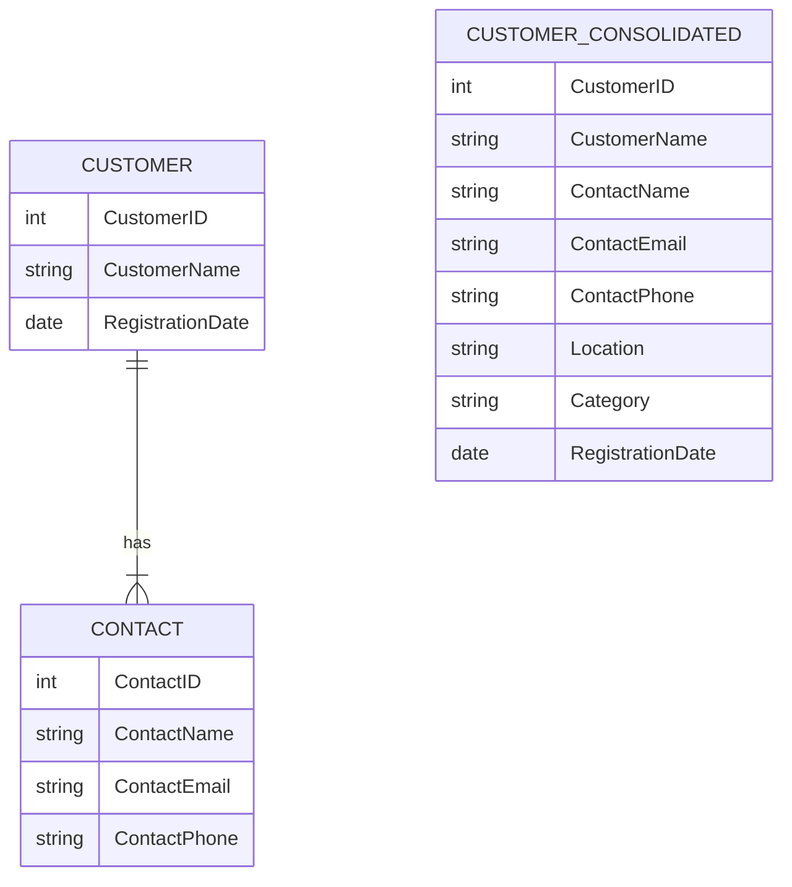

## Introduction

In the realm of dimensional modeling and data warehousing, the concept of Consolidated Dimensions plays a pivotal role. Consolidated dimensions are formed by integrating multiple related dimensions into a single dimension. This approach simplifies the data model, reduces the complexity of ETL (Extract, Transform, Load) processes, and can improve query performance by reducing the number of joins required in queries.

## Detailed Explanation

### Why Use Consolidated Dimensions?

When designing a data warehouse, simplification and performance are key. As data dimensions grow and overlap, modeling them individually can lead to complex schemas with numerous relationships. Consolidated dimensions help by:

- **Reducing Complexity**: By merging related dimensions, you streamline the data model and reduce the cognitive load on analysts and developers.
- **Improving Query Performance**: Queries run faster with fewer joins, making data retrieval more efficient.
- **Simplified ETL Processes**: With fewer dimensions, the data loading and transformation processes are simplified, making them easier to maintain and debug.
  
### Key Considerations

1. **Relation and Relevance**: Ensure that the dimensions being consolidated relate closely and that this consolidation doesn’t lead to a loss of important distinctions within the data.
2. **Data Volume and Redundancy**: Be cautious of increased storage needs due to redundant data; however, the trade-off might be worth the improved simplicity and performance.
3. **Consistency and Maintenance**: Ensure that consolidated dimensions remain consistent over time as more data is added or changes occur.

### Example

Consider the need to manage customer-related information across various functions such as sales, support, and marketing. Traditionally, you might have "Customer" and "Contact" as separate dimensions. However, their overlap — such as shared customer IDs and related information — can make them ideal candidates for consolidation.

```sql
CREATE TABLE CustomerConsolidated (
    CustomerID INT PRIMARY KEY,
    CustomerName VARCHAR(100),
    ContactName VARCHAR(100),
    ContactEmail VARCHAR(100),
    ContactPhone VARCHAR(15),
    Location VARCHAR(100),
    Category VARCHAR(50),
    RegistrationDate DATE
);
```

In this consolidated table, "Customer" and "Contact" have been merged to create a streamlined dimension that retains all the necessary attributes.

### Diagram

Here's a simple diagram illustrating the transformation:



## Related Patterns

- **Junk Dimension**: A pattern for managing miscellaneous transactional data in a consolidated manner.
- **Degenerate Dimension**: Used when a fact table stores dimensional data without the dimension table itself.
- **Role-Playing Dimensions**: Dimensions that play different roles in the same database schema.

## Additional Resources

- Kimball, R., & Ross, M. (2013). *The Data Warehouse Toolkit: The Definitive Guide to Dimensional Modeling*. John Wiley & Sons.
- Online Course: [Data Warehousing and Data Modeling](https://www.udacity.com/course/data-warehousing--nd027)
- Article: [Simplifying Data Warehouse Design with Consolidated Dimensions](https://www.datavail.com/learning/simplifying-data-warehouse-design)

## Summary

Consolidated Dimensions provide a useful approach to managing dimensional data, particularly when simplification, performance, and maintainability are priorities. By merging related dimensions, you streamline data models, reduce processing overhead, and potentially optimize query performance, playing a key role in effective data warehousing strategies.
