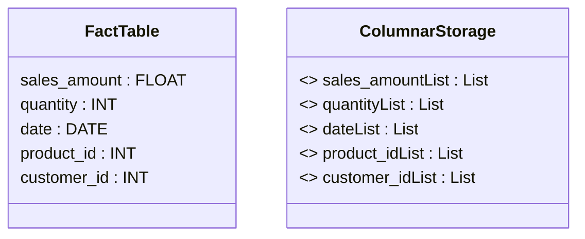

## Introduction

In the realm of data warehousing and business intelligence, the need to efficiently query and analyze large volumes of data is paramount. Fact tables, which store quantitative data for analysis and may include measurements, metrics, or facts from a business process, can grow extremely large. Traditional row-oriented storage methods can lead to inefficient query performance because they require reading entire rows, even when only certain columns are needed.

The **Columnar Storage for Fact Tables** pattern addresses this challenge by organizing data column-wise rather than row-wise, significantly optimizing the performance of data retrieval operations.

## Detailed Explanation

### Columnar vs. Row-Oriented Storage

- **Row-Oriented Storage**: Each row of a table is stored together. This is efficient for transactional operations where an entire record needs to be read or modified.
- **Columnar Storage**: Data is stored by columns rather than by rows. Ideal for OLAP (Online Analytical Processing) systems where queries tend to select a few columns from potentially millions of rows.

### Advantages of Columnar Storage

1. **Efficiency in Data Retrieval**: Queries that require aggregate calculations over large datasets can perform significantly faster because only the relevant columns are read into memory.
2. **Data Compression**: Columnar data formats often use advanced compression techniques. Data within a column is more homogeneous than data within a row, leading to higher compression ratios.
3. **Improved Cache Utilization**: When querying data, only the needed columns are loaded, improving the efficiency of CPU cache usage.
4. **Reduced I/O Operations**: Minimizing disk I/O by reading only necessary columns results in speedier query execution.

### Implementation Example

Consider a `Sales` fact table with millions of records. Queries often involve summations and filtering on specific columns such as `sales_amount`, `quantity`, and `date`.

```sql
-- Columnar Storage Example Query
SELECT SUM(sales_amount), AVG(quantity)
FROM Sales
WHERE date BETWEEN '2023-01-01' AND '2023-12-31'
```

Using a columnar storage model, only the `sales_amount`, `quantity`, and `date` columns need to be read, significantly enhancing performance compared to row-oriented models.

### Architectural Approaches

1. **Database Support**: Modern databases like Amazon Redshift, Google BigQuery, and Snowflake inherently support columnar storage formats.
2. **File-Based Columnar Formats**: Apache Parquet and ORC (Optimized Row Columnar) are widely used for structuring data in columnar fashion outside traditional database systems, particularly in big data scenarios such as Hadoop.

### Related Patterns

- **Indexing Pattern**: Further optimizes data access, complementing columnar storage by providing quick access paths to the data.
- **Materialized View Pattern**: Stores precomputed views or results from fact tables for frequent queries to speed up execution.

## Example Diagram

Here is an example of how columnar storage can be conceptually visualized.



### Additional Resources

- **Amazon Redshift Documentation**: A comprehensive guide on leveraging columnar storage.
- **Google BigQuery Best Practices**: Optimizing query performance using BigQuery's columnar storage.
- **Understanding Parquet File Format**: An in-depth look at the Parquet columnar storage format.

## Summary

The **Columnar Storage for Fact Tables** pattern significantly improves the performance of analytical queries on large datasets frequently encountered in data warehousing. By storing data as columns rather than rows, it allows databases to read only the data necessary for a query, utilizes better compression techniques, and optimizes memory usage through efficient caching. Implementing this pattern can lead to large reductions in query time, making it pivotal for performance optimization in OLAP systems.
