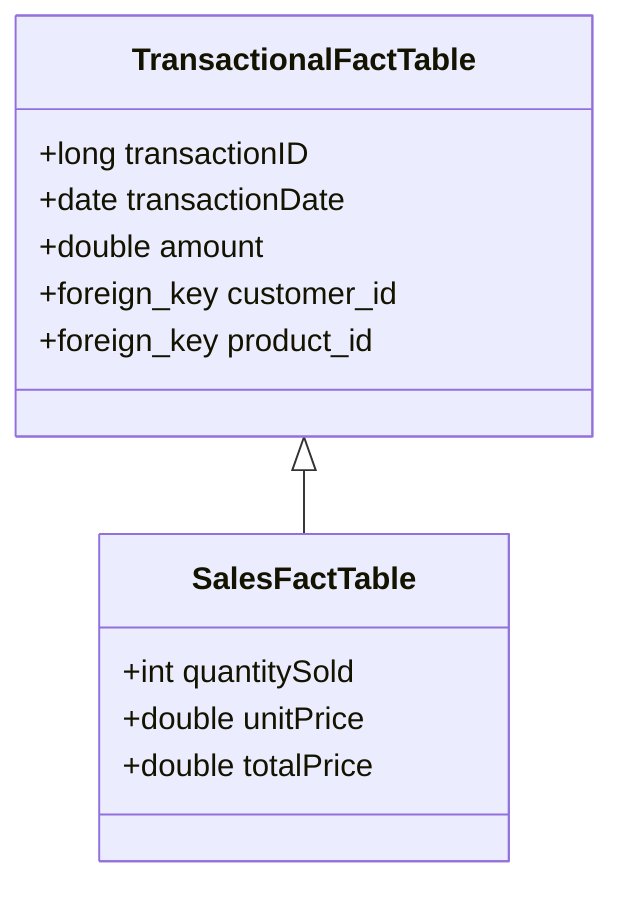

## Introduction to Transactional Fact Table

In the realm of data warehousing, a **Transactional Fact Table** is integral to capturing and storing transactional data at the most granular level. These tables meticulously log all individual transactions, thereby allowing businesses and analysts to perform detailed, transaction-level analytics and reporting.

## Design Pattern Explanation

A **Transactional Fact Table** is characterized by its focus on capturing discrete events that are transactional in nature. These tables serve as repositories for detailed transaction data where each record contains data specific to a single event or transaction. For instance, in a sales-focused data warehouse, a fact table designed using this pattern might include metrics like `QuantitySold` for each transaction.

### Key Features:
- **Granularity**: Records each transaction separately, often at the lowest level of granularity available, such as individual sales or returned items.
- **Measures**: Typically stores quantitative data such as quantity, unit price, and total sales value.
- **Foreign Keys**: Connects dimensions that provide additional context to the transaction, such as Date, Time, Customer, and Product.
- **Timestamp**: Often includes time-based attributes to analyze transactions over periods.

### Diagram Representation:

Here's a simple example using a Mermaid UML Class Diagram for a `Sales` Transactional Fact Table:



## Example Code

Suppose you are working with a SQL-based data warehouse. Here's a skeleton create table statement for a `Sales` transactional fact table:

```sql
CREATE TABLE SalesFact (
    TransactionID BIGINT PRIMARY KEY,
    TransactionDate DATE,
    QuantitySold INT,
    UnitPrice DECIMAL(10, 2),
    TotalSalesValue AS (QuantitySold * UnitPrice),
    CustomerID INT,
    ProductID INT,
    FOREIGN KEY (CustomerID) REFERENCES Customers(CustomerID),
    FOREIGN KEY (ProductID) REFERENCES Products(ProductID)
);
```

## Related Patterns

- **Snapshot Fact Table**: Unlike transactional fact tables, snapshot tables record data at specific points in time, typically summarizing or averaging out measures for periodic reporting.
  
- **Accumulating Snapshot Fact Table**: This pattern captures data involving processes that have a well-defined start and end point, like an order fulfillment process.

## Additional Resources

- [Kimball Group’s Data Warehousing Concepts](https://www.kimballgroup.com)
- Book: *The Data Warehouse Toolkit* by Ralph Kimball
- [AWS Big Data Blog](https://aws.amazon.com/blogs/big-data/)
  
## Summary

The **Transactional Fact Table** is a crucial pattern for organizing and storing detailed transaction-level data in a data warehouse. Its role is to provide insights into operations by capturing each transaction's specificities. Effective design and implementation facilitate robust analytical capabilities by allowing granular analysis while ensuring flexibility in business intelligence endeavors.
