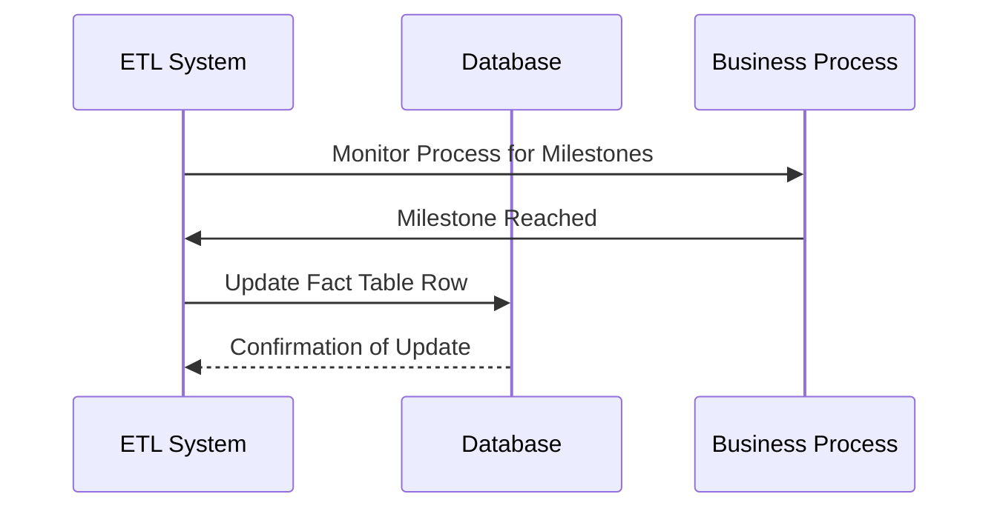

---

linkTitle: "Accumulating Snapshot Fact Table"
title: "Accumulating Snapshot Fact Table"
category: "Dimensional Modeling Patterns"
series: "Data Modeling Design Patterns"
description: "Tracks the cumulative progress of processes with multiple steps, updated as each milestone is reached."
categories:
- Data Modeling
- Dimensional Modeling
- Fact Table
tags:
- Fact Table
- Data Warehouse
- Dimensional Modeling
- Accumulating Snapshot
- ETL
date: 2024-07-07
type: docs

canonical: "https://softwarepatternslexicon.com/102/2/6"
license: "© 2024 Tokenizer Inc. CC BY-NC-SA 4.0"
---


## Introduction

The Accumulating Snapshot Fact Table is a dimensional modeling pattern used to track the cumulative progress of a single business process that unfolds over a defined and stable set of steps. Unlike transaction fact tables that record an event at a single point in time or periodic snapshot tables that capture data at predetermined intervals, accumulating snapshot tables are updated continually as events progress through various milestones.

## Detailed Explanation

Accumulating Snapshot Fact Tables are instrumental in scenarios where a business process has a clear beginning and end and involves various intermediate steps or milestones. Such processes may include order fulfillment, loan application processing in financial services, or supply chain logistics.

### Key Characteristics

- **Milestone Capturing**: Accumulating snapshots capture dates (and sometimes other KPI values) at which key milestones occur. Each milestone in the process is represented by a separate date (or timestamp) column in the table.
  
- **Continual Updates**: Rows in an accumulating snapshot table are updated each time an event reaches a new milestone. This means an existing row is overwritten rather than added to.

- **Limited History**: While they keep a concise view of the progress through the process, they might not maintain entire historical records of changes except the final state of each tracked process.

### Typical Structure

Each row in an accumulating snapshot fact table corresponds to an instance of the process being tracked. Early in its lifecycle, certain date fields may be null or defaulted until their milestones are reached:

| Process_ID | Order_Placed_Date | Order_Processed_Date | Order_Shipped_Date | Order_Delivered_Date | ... |
|------------|-------------------|----------------------|--------------------|----------------------|-----|
| 12345      | 2024-06-01        | 2024-06-03           | 2024-06-05         | 2024-06-07           | ... |

The table is updated as each subsequent stage in the process is reached and recorded.

## Architectural Approaches

### Dimensional Modeling

Following Kimball's approach, the structure aligns well with star schemas used in dimensional modeling frameworks. The fact table connects with dimension tables representing details about each step, such as product, customer, and location.

### ETL Processing

ETL (Extract, Transform, Load) systems need to ensure that they detect the current state of the process and update the respective records accurately. Incremental data loading techniques help minimize the performance impact on the data warehouse during the update process.

## Best Practices

1. **Define Clear Milestones**: Establish clear and unambiguous business milestones that can be tracked as discrete events.
   
2. **Handle Late Arriving Data**: Implement strategies for dealing with data that arrives after the fact to ensure updates are still accurately applied.

3. **Balanced Schema Design**: Balance between the granularity of the tracked milestones and the extent of historical tracking needed for analysis expectations.

4. **Optimize for Updates**: Given their update-heavy nature, ensure that primary keys and indexes are optimized for write performance.

## Example Code

Below is a simplified version of how one might update an order fulfillment accumulating snapshot table using SQL:

```sql
UPDATE OrderFulfillmentFact
SET Order_Shipped_Date = GETDATE()
WHERE Order_ID = @OrderID
AND Order_Shipped_Date IS NULL;
```

## Diagrams

Here is a high-level representation using a UML sequence diagram for the processing and updating of an accumulating snapshot fact table:


## Related Patterns

- **Transactional Fact Table**: Captures transactional details at a fine-grained level suitable for detailed historical analysis.

- **Periodic Snapshot Fact Table**: Records data at specified intervals rather than per milestone basis.

## Additional Resources

- [The Data Warehouse Toolkit by Ralph Kimball and Margy Ross](https://www.kimballgroup.com)
- [DwBi.org on Fact Tables Types](https://www.dwbi.org)

## Summary

Accumulating Snapshot Fact Tables offer a powerful way to track and analyze processes that consist of well-defined steps and milestones. By enabling continuous updates, businesses can effectively gauge the status and performance of key processes without overwhelming their data warehouse with excessive row history data. Their design and implementation require careful planning to ensure data integrity and query performance, but the insights they deliver can be invaluable for decision-making and reporting.


