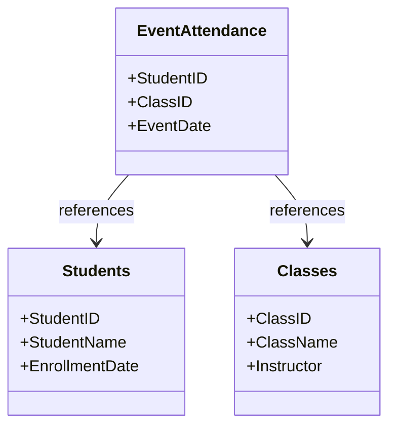

## Factless Fact Table

Factless fact tables are an important concept in dimensional modeling, often found in data warehousing scenarios. These tables do not include any quantitative measures but instead, consist solely of foreign keys that reference dimension tables. They serve primarily to capture the occurrence of activities or track event participation and coverage, providing valuable insights for further analytical processing.

### Common Use Cases

1. **Event Tracking**: To track the attendance of students in classes, workshops, or seminars. For instance, a University might use a factless fact table, `EventAttendance`, which records which students attended which sessions, characterized only by IDs for students, events, time, location, etc.

2. **Coverage Analysis**: Identifying periods or instances without activities can be essential, especially in process or workflow compliance. For example, in a retail setting, a factless fact table might record the days on which certain promotional offers were available, enabling analysts to detect gaps in coverage.

3. **Junction Representation**: When modeling many-to-many relationships, such as linking products to promotions when no numeric metrics are necessary.

### Architectural Considerations and Best Practices

- **Purpose-Centric Design**: Ensure the initiative for creating factless fact tables is driven by clear, specific business questions or analytic requirements.
- **Optimize Join Performance**: Since factless fact tables rely solely on dimension keys, optimize your database for efficient joins, which often involves creating appropriate indices.
- **Aggregation Challenges**: Recognize that without direct counts or sums in the table, you need to address aggregation by counting rows after joining with relevant dimension tables.
- **Size Management**: Although there are no numeric measures, the potentially large number of rows due to stored keys necessitates strategies for efficient storage and quick retrieval.

### Example Implementation

```sql
CREATE TABLE EventAttendance (
    StudentID INT,
    ClassID INT,
    EventDate DATE,
    PRIMARY KEY (StudentID, ClassID, EventDate),
    FOREIGN KEY (StudentID) REFERENCES Students(StudentID),
    FOREIGN KEY (ClassID) REFERENCES Classes(ClassID)
);
```

This SQL creates a factless fact table, `EventAttendance`, that logs attendance without capturing numeric values. Through appropriate joins with `Students` and `Classes` dimension tables, useful insights can be drawn.

### Diagram Representation



### Related Patterns

- **Conformed Dimensions**: Consistent use of dimension tables across different fact tables, including factless ones, to ensure uniformity.
- **Periodic Snapshot Fact Table**: Records the state of certain dimensions at regular intervals without explicit events.
- **Event Fact Table**: Unlike factless fact tables, these capture both the occurrence of an event and associated quantitative data.

### Additional Resources

- *The Kimball Group Reader* by Ralph Kimball and Margy Ross
- Articles on dimensional modeling strategies in data warehousing platforms such as AWS Redshift or Google BigQuery
- Blog posts and tutorials about different types of fact tables and their roles in data warehousing

### Summary

Factless fact tables play a critical role in the analytic realm of data warehousing where capturing the mere occurrence of events is enough for analysis purposes. Without including any measures, these tables enable businesses to track, relate, and verify events or coverage within their operating schema, providing significant insights into data contexts traditionally overlooked by quantitative measures alone. By understanding how to implement and use these tables effectively, organizations can extract deeper, compliance-focused, and event-driven insights from their enterprise data architecture.
