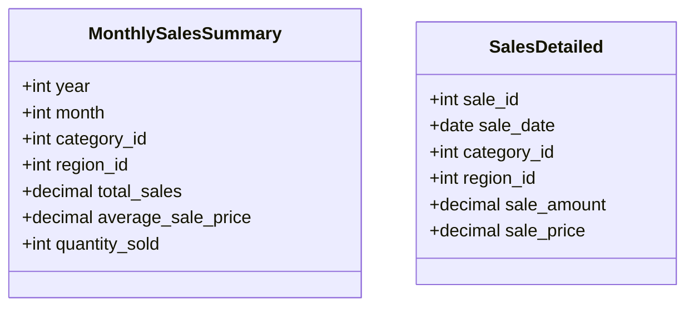

---

linkTitle: "Aggregate Fact Table"
title: "Aggregate Fact Table"
category: "Dimensional Modeling Patterns"
series: "Data Modeling Design Patterns"
description: "The Aggregate Fact Table pattern is used to store pre-summarized data to enhance query performance for common aggregate queries, reducing the need for on-the-fly calculations."
categories:
- Data Modeling
- ETL
- Database Optimization
tags:
- Dimensional Modeling
- Performance Tuning
- Data Warehousing
- OLAP
- BI
date: 2024-07-07
type: docs

canonical: "https://softwarepatternslexicon.com/102/2/8"
license: "© 2024 Tokenizer Inc. CC BY-NC-SA 4.0"
---


## Introduction
The Aggregate Fact Table pattern provides a mechanism for improving the performance of data analytics queries by storing summarized or aggregated data. This pattern is beneficial in the context of dimensional modeling, particularly in data warehousing, OLAP (Online Analytical Processing), and business intelligence solutions. By pre-computing and storing aggregations, Oracle's Aggregate Fact Table pattern reduces the need to perform costly computations at query run-time.

## Detailed Explanation

### Purpose
In data warehousing, fact tables store quantitative data for analysis. When users frequently request aggregated data, such as monthly sales totals, it can be inefficient to repeatedly compute these aggregates from detailed transactional data. The Aggregate Fact Table design pattern addresses this by storing these pre-computed aggregates in a separate table.

### Structure
An aggregate fact table typically derives its structure from a base fact table but contains reduced granularity. Common dimensions may include time, category, location, or any dimension on which aggregates are based. For example, a MonthlySalesSummary table might have the following structure:

- **Time Dimension**: Year, Month
- **Product Dimension**: Product Category
- **Geography Dimension**: Region or Country
- **Measures**: Total Sales, Average Sale Price, Quantity Sold

### Benefits
- **Improved Query Performance**: Reduces query execution time by eliminating the need to process large volumes of detailed data.
- **Reduced Computational Load**: Minimizes resource utilization on database servers for aggregation tasks.
- **Simplified Reporting**: Facilitates faster development of reports and dashboards by leveraging pre-computed metrics.

### Implementation Considerations
- **ETL Process**: Requires updates to ETL (Extract, Transform, Load) processes to populate and maintain aggregate fact tables concurrently with population of detail-level fact tables.
- **Consistency Management**: Care must be taken to ensure that the aggregate table remains consistent with underlying detail data especially after data updates.
- **Storage Costs**: Consider trade-offs between storage costs and performance gains since storing aggregates can increase data volume.

## Example Code

Here's a simplified example of creating an aggregate fact table using SQL, which summarizes sales data monthly:

```sql
CREATE TABLE MonthlySalesSummary (
    year INT,
    month INT,
    category_id INT,
    region_id INT,
    total_sales DECIMAL(10, 2),
    average_sale_price DECIMAL(10, 2),
    quantity_sold INT,
    PRIMARY KEY (year, month, category_id, region_id)
);

INSERT INTO MonthlySalesSummary (year, month, category_id, region_id, total_sales, average_sale_price, quantity_sold)
SELECT
    YEAR(sale_date),
    MONTH(sale_date),
    category_id,
    region_id,
    SUM(sale_amount),
    AVG(sale_price),
    COUNT(sale_id)
FROM
    SalesDetailed
GROUP BY
    YEAR(sale_date),
    MONTH(sale_date),
    category_id,
    region_id;
```

## Diagrams

### Mermaid UML Class Diagram



## Related Patterns

- **Star Schema**: Aggregate Fact Tables often complement Star Schemas by providing aggregated data for reports efficiently.
- **Snowflake Schema**: Used alongside more normalized models, aggregate tables can reduce complexity in querying extensively joined tables.

## Additional Resources

- [Kimball's Data Warehouse Toolkit](https://www.kimballgroup.com/)
- [OLAP Report](http://www.olapreport.com/)
- [Oracle Data Warehousing Guide](https://docs.oracle.com/en/database/oracle/oracle-database/19/dwhsg/)

## Summary
The Aggregate Fact Table pattern is a strategic approach in data warehousing to enhance query performance for commonly accessed aggregates. By storing pre-summarized data, it optimizes resource usage and speeds up reporting and analysis processes. However, careful consideration of the storage costs and ETL complexities is required to maximize the benefits. 

By adopting the Aggregate Fact Table pattern, organizations can achieve quicker insights and enable data-driven decision-making more efficiently.
