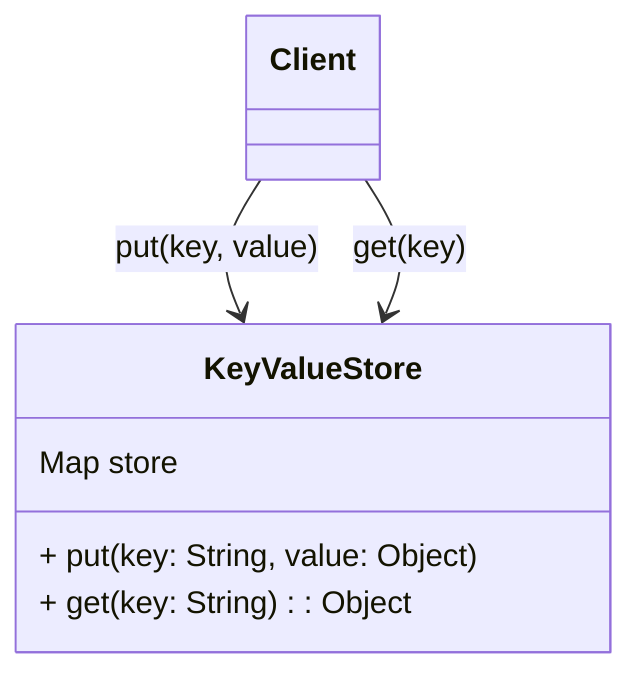

## Overview

The Simple Key-Value Pattern is a data modeling approach where data is stored as key-value pairs, enabling fast and efficient data retrieval. This pattern is fundamental to NoSQL databases, especially those focused on key-value storage systems such as Redis and Amazon DynamoDB.

## Architectural Structure

In this pattern, each key is unique and is associated with a single value. This allows applications to quickly look up data based on the unique key. The architecture generally consists of a client application interfacing with a key-value store which provides methods for creating, reading, updating, and deleting key-value pairs.

### Diagram of Simple Key-Value Pattern



## Implementation Example

Consider an example where user session data is being cached using Redis.

### Java Redis Example

```java
import redis.clients.jedis.Jedis;

// Establish Redis connection
Jedis jedis = new Jedis("localhost", 6379);

// Store data
String sessionId = "user123";
String userData = "{\"username\": \"john_doe\", \"role\": \"admin\"}";
jedis.set(sessionId, userData);

// Retrieve data
String storedData = jedis.get(sessionId);
System.out.println("Retrieved Session Data: " + storedData);
```

### Go with DynamoDB Example

```go
package main

import (
    "fmt"
    "github.com/aws/aws-sdk-go/aws"
    "github.com/aws/aws-sdk-go/aws/session"
    "github.com/aws/aws-sdk-go/service/dynamodb"
)

func main() {
    svc := dynamodb.New(session.New(), &aws.Config{Region: aws.String("us-west-2")})

    // Key-Value Write
    putItemInput := &dynamodb.PutItemInput{
        TableName: aws.String("Sessions"),
        Item: map[string]*dynamodb.AttributeValue{
            "SessionID": {
                S: aws.String("user123"),
            },
            "UserData": {
                S: aws.String("{\"username\": \"john_doe\", \"role\": \"admin\"}"),
            },
        },
    }

    _, err := svc.PutItem(putItemInput)
    if err != nil {
        fmt.Println("Failed to write to DynamoDB", err)
        return
    }

    // Key-Value Read
    getItemOutput, err := svc.GetItem(&dynamodb.GetItemInput{
        TableName: aws.String("Sessions"),
        Key: map[string]*dynamodb.AttributeValue{
            "SessionID": {
                S: aws.String("user123"),
            },
        },
    })
    if err != nil {
        fmt.Println("Failed to read from DynamoDB", err)
        return
    }

    fmt.Println("Retrieved Session Data:", getItemOutput.Item["UserData"])
}
```

## Related Patterns

- **Document Store Pattern**: Extends the key-value model by allowing complex attributes stored for a key as a document.
- **Wide-Column Store Pattern**: Ideal for tabular data, where columns can be added dynamically.
- **Cache-Aside Pattern**: Often used in conjunction with key-value stores to dynamically cache data.

## Additional Resources

- [Redis Documentation](https://redis.io/documentation)
- [Amazon DynamoDB Documentation](https://docs.aws.amazon.com/dynamodb/index.html)
- [Key-Value Data Modeling Techniques](https://link-to-external-resource)

## Summary

The Simple Key-Value Pattern is a foundational NoSQL data modeling strategy suited for scenarios requiring high-speed data access and simplicity. Its ease of use and scalability makes it a popular choice for caching, session management, and any application where straightforward data retrieval is crucial.
