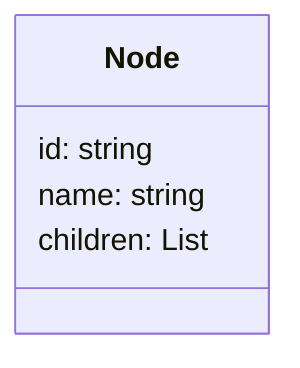

## Overview

The Adjacency List Pattern is a data modeling technique often used to represent hierarchical data or graph-like relationships in NoSQL databases. This pattern is particularly useful when the system needs to frequently access adjacency relationships directly. Fundamentally, it involves storing each node or entity along with its list of direct children or adjacent nodes within the same record.

## Architectural Approach

### Structure

In the Adjacency List Pattern, each node maintains a list of related nodes or entities, generally through their identifiers. This enables a straightforward representation of parent-child and peer relationships:

```json
{
  "id": "node1",
  "name": "Unit A",
  "children": ["node2", "node3"]
}
```

The example above illustrates a simple implementation where "Unit A" is connected to "node2" and "node3". Each node can have an arbitrary number of child nodes, making this pattern highly flexible and well-suited for various hierarchical structures such as organizational charts or category trees.

### Paradigms

- **Hierarchical and Graph Representation**: Adjacency lists provide an efficient means of structuring and querying both tree-like hierarchies and arbitrary graphs.
- **Direct Access Patterns**: The direct listing of node relationships facilitates rapid querying of immediate connections.

## Best Practices

- **Consistent Use of Identifiers**: It's crucial to use consistent and unique identifiers for nodes to avoid discrepancies in connections and ensure the integrity of relationships.
- **Efficient Indexing**: Leverage database indexing capabilities on node identifiers to optimize read performance on frequently queried connections.
- **Handling Orphans**: Implement integrity checks to avoid having nodes that are neither referenced nor connected, which can lead to data inconsistencies.

## Example Code

Here's an example code snippet in JavaScript illustrating how to query nodes using the adjacency list pattern:

```javascript
// Mock representation of the data store
const nodes = {
  "unitA": { name: "Unit A", children: ["unitB", "unitC"] },
  "unitB": { name: "Unit B", children: [] },
  "unitC": { name: "Unit C", children: ["unitD"] },
  "unitD": { name: "Unit D", children: [] }
};

// Function to get children of a given node
function getChildren(nodeId) {
  return nodes[nodeId]?.children || [];
}

console.log(getChildren("unitA")); // Output: ["unitB", "unitC"]
```

## Diagrams

Here's a simple UML class diagram using Mermaid that illustrates the Adjacency List structure:



## Related Patterns

- **Materialized Path Pattern**: Another NoSQL modeling pattern for hierarchical data, where each node stores the complete path from the root to itself.
- **Nested Set Pattern**: Utilizes left/right node numbers to indicate hierarchy, optimal for fixed hierarchies with infrequent changes.

## Additional Resources

- [Graph Databases by Neal Ford - A Comprehensive Guide](https://example.com/graph-databases)
- [Data Modeling Techniques for NoSQL and Relational Databases](https://example.com/nosql-data-modeling)

## Summary

The Adjacency List Pattern is a versatile data modeling strategy employed within NoSQL databases to manage and query hierarchical and graph-based data efficiently. Its structure caters to both direct relationship traversal and dynamic hierarchical configurations, making it highly applicable across various applications like organizational charts and category hierarchies. With attention to consistent identifier usage and proper indexing, this pattern can power robust and performant data systems.
