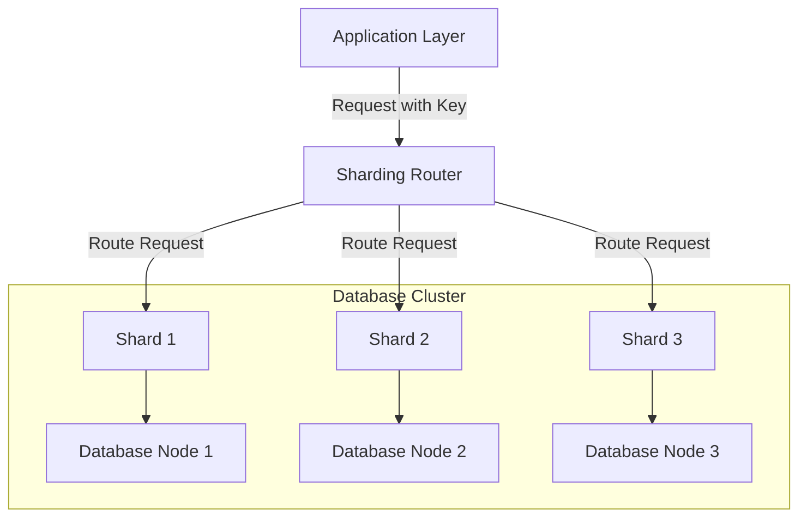

---

linkTitle: "Sharding"
title: "Sharding"
category: "NoSQL Data Modeling Patterns"
series: "Data Modeling Design Patterns"
description: "Distributing data across multiple machines or clusters to improve scalability, by partitioning databases to handle increased loads efficiently."
categories:
- cloud-computing
- data-modeling
- scalability
tags:
- sharding
- NoSQL
- scalability
- data-partitioning
- distributed-systems
date: 2024-07-07
type: docs

canonical: "https://softwarepatternslexicon.com/102/3/13"
license: "© 2024 Tokenizer Inc. CC BY-NC-SA 4.0"
---

## Overview

Sharding is a database partitioning design pattern that involves dividing data across multiple nodes or clusters to achieve scalability and distribute the load efficiently. This approach is particularly effective in handling large datasets and high transaction volumes, common in distributed and cloud-based applications.

## Detailed Explanation

### Goals of Sharding

- **Scalability**: Allowing horizontal scaling by adding more nodes to distribute the load.
- **Availability**: Ensuring high availability by distributing data, so failures in one shard don't affect others.
- **Performance**: Reducing latency by enabling data locality and parallel processing.

### How Sharding Works

In a sharding setup, a database is horizontally partitioned into smaller, more manageable pieces called "shards." Each shard is stored on a different database server or node. A shard key, which is a specific field or set of fields from the database, determines how data is distributed among shards.

#### Example Use Case

Consider a social media application where user profiles are constantly accessed and updated. By using a user ID as a shard key, you can spread users across different shards. This enables concurrent access across servers, reducing bottlenecks and improving application responsiveness.

### Architectural Considerations

- **Choosing a Shard Key**: Selecting an appropriate shard key is crucial. It should evenly distribute the data and access patterns across shards.
- **Rebalancing**: As data grows, shards might need redistribution—dynamic sharding architectures allow automatic rebalancing to maintain performance.
- **Data Consistency**: Ensuring data consistency across shards can be complex, particularly when transactions span multiple shards.

## Example Code

Here's a simple example of configuring sharding with MongoDB using a shard key:

```javascript
// Enable sharding for the database
sh.enableSharding("social_network_db");

// Shard the user_profiles collection on user_id
sh.shardCollection("social_network_db.user_profiles", { "user_id": 1 });
```

## Diagram

Below is a conceptual diagram of a sharded database architecture using Mermaid:



## Related Patterns

- **Database Replication**: Often used together with sharding to enhance data availability and fault tolerance.
- **CQRS (Command Query Responsibility Segregation)**: Sharding can support the segregation of commands and queries over distributed architectures.
- **Cache-Aside**: Combined with sharding to reduce load on shards by caching frequently accessed data.

## Additional Resources

- [MongoDB Sharding Documentation](https://docs.mongodb.com/manual/sharding/)
- [Distributed Systems Concepts by Google](https://research.google/pubs/archive/44849.pdf)
- [Patterns for Scalable Database Architectures - Microsoft Patterns & Practices](https://docs.microsoft.com/en-us/previous-versions/msp-n-p/dn589783(v=pandp.10))

## Summary

Sharding is a vital pattern for today's scalable cloud and distributed applications, offering a robust way to manage large-scale data and traffic loads. By thoughtfully designing the sharding architecture—choosing appropriate shard keys, ensuring efficient shard management, and considering related patterns—you can significantly enhance performance and scalability of your NoSQL databases.

---
