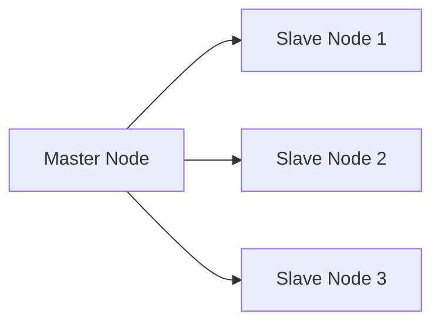

## Overview

Replication is a fundamental design pattern used in distributed systems to achieve redundancy and ensure high availability of data. By replicating data across multiple nodes, a system can continue to operate even when some nodes fail. This pattern is widely used in NoSQL databases like Cassandra, MongoDB, and HBase to enhance data durability and provide fault tolerance.

## Detailed Explanation

### Key Concepts

1. **Data Redundancy**: Keeping multiple copies of the same data across different nodes to safeguard against hardware or network failures.
2. **Consistency**: Ensuring that all copies of the data reflect the same state. This can be challenging and requires careful management of synchronization protocols.
3. **Replication Factor**: Defines the number of copies (replicas) of a dataset maintained across nodes. For example, in Apache Cassandra, a replication factor of 3 means that each piece of data is stored on three different nodes.
4. **Consistency Levels**: Determine the number of replicas that must acknowledge a read or write operation. Options range from single to all available replicas.

### Architectural Approaches

- **Master-Slave Replication**: A single master node handles write operations, and data changes are propagated to one or more slave nodes. This model provides strong consistency but can be a bottleneck.
  
- **Multi-Master Replication**: Multiple nodes can accept write operations and synchronize between themselves to maintain consistency. This model offers high availability and improved performance but may lead to conflicts.

- **Quorum-Based Replication**: Read and write operations require acknowledgment from a majority of replicas, ensuring data consistency without all replicas needing to be contacted.

## Best Practices

- **Optimize Replication Factor**: Balance between redundancy and resource usage. A higher replication factor typically increases fault tolerance but requires more storage.
  
- **Choose Appropriate Consistency Levels**: Depending on your use case, configure the consistency levels to favor speed (eventual consistency) or accuracy (strong consistency).
  
- **Monitor and Adjust Nodes**: Continuously ensure that nodes are performing correctly and sync data efficiently, especially in dynamic cloud environments.

## Example Code

### Configuring Replication in Apache Cassandra

```cql
CREATE KEYSPACE example_keyspace WITH replication = {
  'class' : 'SimpleStrategy',
  'replication_factor' : 3
};
```

This CQL command sets up a keyspace with a simple replication strategy using a replication factor of 3, ensuring that each piece of data is stored on three nodes.

## Diagrams

Below is a simplified visualization of master-slave replication:



## Related Patterns

- **Sharding**: Distributing data across different nodes to balance the load and provide scalability.
- **Load Balancing**: Directing network traffic optimally to avoid overloading any single node.

## Additional Resources

- [Apache Cassandra Documentation](https://cassandra.apache.org/doc/)
- [Designing Data-Intensive Applications by Martin Kleppmann](https://dataintensive.net/)
- [NoSQL Distilled by Pramod J. Sadalage and Martin Fowler](https://www.amazon.com/NoSQL-Distilled-Emerging-Technology-Architecture/dp/0321826620)

## Summary

Replication is a critical pattern for ensuring data availability and resilience in distributed systems. By understanding and correctly implementing various replication strategies and consistency levels, organizations can achieve optimal data accessibility while balancing system performance and resource allocation. This pattern is essential for systems requiring high availability, fault tolerance, and data integrity in demanding, dynamically-scalable environments such as cloud computing.
