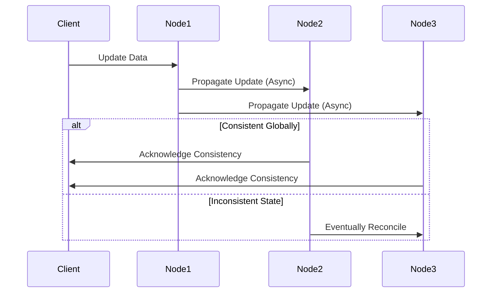

---

linkTitle: "Eventual Consistency"
title: "Eventual Consistency Design Pattern"
category: "3. NoSQL Data Modeling Patterns"
series: "Data Modeling Design Patterns"
description: "The Eventual Consistency pattern accepts that data may become consistent over time across replicas, balancing availability and partition tolerance in distributed systems."
categories:
- Distributed Systems
- NoSQL
- Data Consistency
tags:
- Eventual Consistency
- Distributed Databases
- AP Theorem
- CAP Theorem
- Data Consistency
date: 2024-07-07
type: docs

canonical: "https://softwarepatternslexicon.com/102/3/15"
license: "© 2024 Tokenizer Inc. CC BY-NC-SA 4.0"
---

## Design Pattern: Eventual Consistency

### Description

The Eventual Consistency pattern is a cornerstone concept in distributed systems, particularly in the context of NoSQL databases. It allows systems to remain available and honor partition tolerance in the CAP theorem landscape by accepting that replicas of the data may not be immediately consistent but will converge to the same state over time without explicit synchronization. This model is particularly relevant in designing scalable systems that require high availability and fault tolerance across distributed nodes.

### Architectural Overview

In a distributed database environment, updates are propagated asynchronously. This means that when a write operation occurs, it is not immediately visible to all nodes. Over time, through background processes and synchronization mechanisms, the changes propagate across the system, ensuring that all replicas will eventually reach the same consistent state. The goal is to maintain system responsiveness and uptime while ensuring that data consistency occurs eventually.

### Best Practices

1. **Understand the Business Context**: Apply eventual consistency in scenarios where temporary data inconsistency is permissible and does not affect business operations significantly.
2. **Tune Replication Delay**: Consider the acceptable replication delay for your use case and set up appropriate monitoring and alerting to manage the propagation across nodes.
3. **Implement Conflict Resolution**: Develop strategies, such as last-write-wins, explicit versioning, or CRDTs (Conflict-free Replicated Data Types), to handle conflicting updates gracefully.
4. **Client-side Read Repair**: Implement mechanisms to correct inconsistencies for reads, such as reading from multiple replicas and picking the latest timestamp.
5. **Leverage Caching**: Use caching strategies to buffer transient inconsistencies for end users, providing a semblance of stability in UI-driven systems.

### Example Code

```java
// Pseudo-code for eventual consistency in database writes
Database database = new DistributedDatabase();

class UpdateOperation {
    // simulate update
    void propagateUpdate(Node node, Update update) {
        node.apply(update);
        node.setAsynchronouslyConsistent(true);
    }
}

class Node {
    boolean isConsistentGlobally = false;

    void apply(Update update) {
        // apply the update locally
    }

    void setAsynchronouslyConsistent(boolean status) {
        isConsistentGlobally = status;
    }
}
```

### Diagram

Here is a simple sequence diagram illustrating the eventual consistency process:



### Related Patterns

- **Strong Consistency**: Opposite pattern where all updates are immediately visible to all nodes.
- **Consistent Hashing**: Helps in evenly distributing data across nodes, key for eventual consistency.
- **Base Properties (Basically Available, Soft State, Eventually Consistent)**: A relaxed variant of the traditional ACID properties tailored for distributed systems.

### Additional Resources

- "Designing Data-Intensive Applications" by Martin Kleppmann – In-depth exploration of consistency models.
- Apache Cassandra Documentation – Use cases and implementation details of eventual consistency.
- AWS DynamoDB – A real-world example that leverages eventual consistency for scalability.

### Summary

The Eventual Consistency design pattern provides a path to optimizing availability and partition tolerance in distributed systems. While it may introduce temporary states of inconsistency, thoughtful architecture and robust conflict resolution strategies can mitigate potential downsides. This model aligns with modern software development trends that prioritize scalability, high availability, and tolerance to network partitions in globally distributed systems.

---
