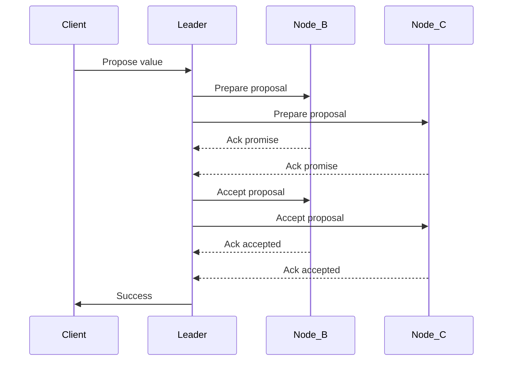

---

linkTitle: "Strong Consistency"
title: "Strong Consistency"
category: "3. NoSQL Data Modeling Patterns"
series: "Data Modeling Design Patterns"
description: "Ensuring immediate consistency across all nodes, often at the cost of performance."
categories:
- Consistency Patterns
- NoSQL
- Data Modeling
tags:
- Strong Consistency
- Paxos
- ZooKeeper
- Consistency Patterns
- Distributed Systems
date: 2024-07-07
type: docs
canonical: "https://softwarepatternslexicon.com/102/3/16"
license: "© 2024 Tokenizer Inc. CC BY-NC-SA 4.0"
---

## Overview

Strong Consistency is a design pattern that ensures all nodes in a distributed system reflect the most recent state of data immediately after a write operation. This pattern is crucial in scenarios where the correctness of operations hinges on having the latest data available to all nodes. While it provides deterministic results and reliability when reading data after writes, it generally trades off in terms of performance and throughput, potentially increasing latency due to the overhead of maintaining synchronous data replication and coordination among nodes.

## Architectural Approach

Strong consistency requires using consensus algorithms that synchronize state across distributed nodes. These algorithms ensure that any changes in data are replicated and confirmed across multiple nodes before they are considered committed. The key architectural considerations include:

1. **Coordination Service**: Use a distributed coordination service that implements consensus protocols, such as Paxos or Raft. Apache ZooKeeper, for example, uses a consensus protocol to maintain strong consistency.

2. **Synchronous Replication**: Data writes are synchronously replicated to ensure all nodes reflect the same state at the same time. The system will delay acknowledging write operations until all replicas confirm the update.

3. **Leader Election**: Distributed systems that require strong consistency often elect a leader node to coordinate write operations. This leader ensures consistency by collecting votes or acknowledgments from other nodes.

4. **Quorum-Based Writes and Reads**: Operations are committed only when a majority (quorum) of nodes agree on the data state, promoting a consistent view of the data.

## Example Code

The following pseudocode demonstrates the basic principle of using Paxos for strong consistency.

```scala
// Define a simple Paxos algorithm sketch.
trait Paxos {
  def propose(value: String): Boolean
  def acceptorPromise(proposalId: Int, value: String): Boolean
  def majorityAccepted(proposalId: Int, value: String): Boolean
}

// Simple Paxos implementation sketch
class SimplePaxos extends Paxos {
  def propose(value: String): Boolean = {
    val proposalId = generateProposalId()
    if (acceptorPromise(proposalId, value)) {
      if (majorityAccepted(proposalId, value)) {
        commitValue(proposalId, value)
        return true
      }
    }
    false
  }

  // Details of generating proposal id, promise, and acceptance logic
  // would rely on hazarding consistent agreement across distributed replicas.
}
```

## Diagram

Below is a basic sequence diagram illustrating a strong consistency operation in a distributed system:



## Related Patterns

- **Eventual Consistency**: A pattern that offers high availability and partition tolerance but provides weak guarantees on when updates will be visible.
- **Causal Consistency**: Ensures that operations that are causally related are seen by all nodes in the same order.

## Additional Resources

- **Apache ZooKeeper Documentation**: [ZooKeeper Overview](https://zookeeper.apache.org/doc/)
- **Raft Consensus Algorithm**: [Raft Publication](https://raft.github.io)
  
## Summary

Strong Consistency is a vital design pattern for situations where data integrity and immediacy are paramount. The use of consensus protocols like Paxos or Raft allows systems to maintain a consistent and up-to-date state across distributed nodes, albeit with a necessary trade-off in performance. Understanding when and how to employ strong consistency is crucial for architects and engineers working in domains that require strict data accuracy, such as financial systems or certain real-time applications.
