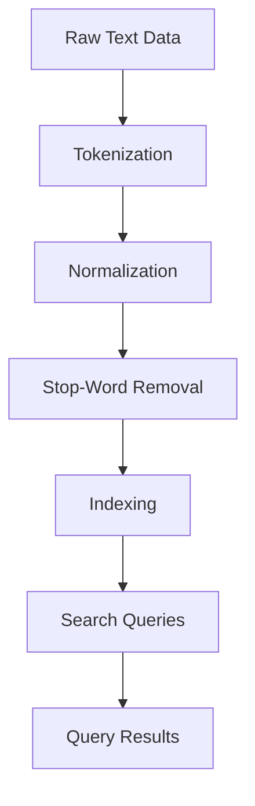

## Full-Text Search Indexes

In modern applications, providing efficient search capabilities over large volumes of text data is crucial for enhancing user experience. Full-text search indexes are specialized indexes that allow for the rapid retrieval of relevant documents based on text queries. These indexes are adept at handling natural language processing tasks and are integral to many web and enterprise applications, enabling searches across fields such as product descriptions, reviews, and more.

### Explanation of Full-Text Search Indexes

Full-text search indexes are specifically designed to support complex queries over text-heavy data. They enable functionality like:

- **Keyword Search**: Finding documents containing specific terms or phrases.
- **Phrase Search**: Locating phrases rather than a set of individual terms.
- **Proximity Search**: Identifying documents where certain words appear within a specified distance from each other.
- **Stemming and Lemmatization**: Handling variations in word forms to improve match accuracy.
- **Relevance Scoring**: Sorting results based on the relevance of documents to the query.

In NoSQL databases that support document storage, such as MongoDB or Elasticsearch, full-text search indexes empower applications with significant search capabilities across unstructured data.

### Architectural Approach

#### Indexing Process

Creating a full-text search index involves the following:

1. **Tokenization**: Breaking down text into smaller components (tokens).
2. **Normalization**: Converting tokens to a common form, typically lower-cased.
3. **Stop-Word Removal**: Filtering out common words that add little value to search results, like "the", "is", etc.
4. **Indexing**: Storing the processed tokens in an efficient data structure to enable quick search and retrieval.

#### Search Queries

Search queries utilize the following operations:

- **Boolean Operators**: Allowing precise searches by using logical operators like AND, OR, NOT.
- **Wildcard Searches**: Enabling flexible searches with patterns, e.g., searching for "car*" to find "car", "cars", "carpet".
- **Fuzzy Searches**: Handling typographical errors or near matches in search terms.

### Example Code: Elasticsearch Full-Text Search

```json
PUT /products
{
  "mappings": {
    "properties": {
      "description": {
        "type": "text"
      }
    }
  }
}

POST /products/_doc/1
{
  "description": "This is a powerful vacuum cleaner designed for efficient household cleaning."
}

GET /products/_search
{
  "query": {
    "match": {
      "description": "vacuum cleaner"
    }
  }
}
```

In the above Elasticsearch example, a full-text index is created on a "description" field, allowing users to search for terms like "vacuum cleaner" efficiently.

### Diagrams

#### Full-Text Search Index Workflow



### Related Patterns

- **Inverted Index**: This pattern forms the basis of full-text search systems by mapping terms to their locations in documents, enabling rapid search capability.
- **Faceted Search Pattern**: Works alongside full-text indices by providing faceting on search results, improving navigation in search interfaces.

### Additional Resources

- [Elasticsearch Documentation](https://www.elastic.co/guide/en/elasticsearch/reference/current/index.html)
- [Solr Query Language](https://lucene.apache.org/solr/)
- [Text Search in MongoDB](https://docs.mongodb.com/manual/text-search/)

### Summary

Full-text search indexes are an essential pattern for any application requiring robust search functionality over text data. By pre-processing data through tokenization, normalization, and intelligent indexing strategies, they vastly improve search efficiency and accuracy. Utilized effectively, full-text search capabilities enhance usability within applications, delivering relevant information swiftly to users and facilitating deep insights into large text corpuses.
