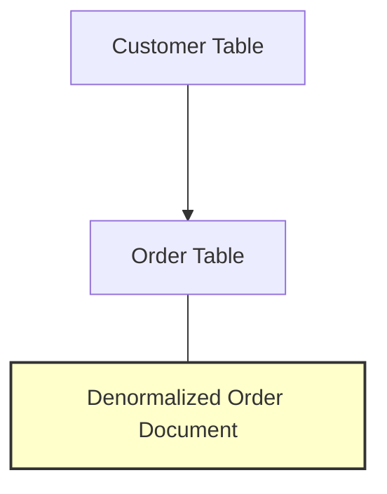

## Data Denormalization

Data Denormalization is an architectural pattern that prioritizes read performance improvement in distributed systems by deliberately duplicating data. In NoSQL databases, which are often schema-less, this pattern is particularly vital as it facilitates fast reads at the expense of increasing redundancy and potentially complicating data updates.

### Detailed Explanation

**Purpose**: In distributed systems and NoSQL databases, read speeds are critically prioritized over write speeds because applications typically read data more frequently than they write data. Denormalization serves this need by duplicating data so that it can be accessed without performing join operations.

**Functionality**:
- **Redundant Data Storage**: Store the same piece of data in multiple collections or tables optimized for its specific access patterns, thus reducing costly data lookups.
- **Increased Read Speed**: Each dataset can be fetched quickly without real-time data transformations or joins, significantly reducing query response times, especially for read-heavy applications.
- **Write Complexity Trade-offs**: While reading becomes simpler and faster, writes may become more complex because any change to a piece of data needs to be reflected in all places where it exists.

### Architectural Approaches

1. **Composite Documents**: Structure data documents to include nested and repeated information within them. E.g., an order document containing a complete copy of the customer information.
2. **Materialized Views**: Pre-calculate and store query results in a new database object that can be queried similarly to standard data without real-time aggregations.
3. **Eventual Consistency**: Opt for eventual consistency to manage the denormalization spread across systems while accepting eventual synchronization delays.

### Best Practices

- **Balance Read and Write**: Analyze application performance demands to find the right balance between read and write complexities.
- **Data Versioning**: Implement data version control to manage different versions of denormalized data, especially useful during schema evolution.
- **Synchronization Mechanisms**: Utilize background jobs, CDC (Change Data Capture), or message brokers (like Kafka) to synchronize changes across different data stores.

### Example Code

```javascript
// Example showing denormalized JSON document
{
  "orderId": "12345",
  "orderDate": "2024-07-01",
  "customer": {
    "customerId": "987654321",
    "name": "John Doe",
    "email": "johndoe@example.com",
    "address": "123 Elm Street"
  },
  "items": [
    {
      "productId": "abc123",
      "quantity": 2,
      "price": 19.99
    },
    {
      "productId": "def456",
      "quantity": 1,
      "price": 49.99
    }
  ],
  "status": "Shipped"
}
```

### Diagrams

Here is a simple Mermaid diagram showing the denormalization pattern:



### Related Patterns

- **Caching**: While data denormalization keeps data close to where it’s read, caching temporarily stores data to avoid re-fetching.
- **Event Sourcing**: Can work alongside to keep track of changes ensuring consistency across denormalized datasets.
- **CQRS (Command Query Responsibility Segregation)**: Further separates read and write operations, facilitating efficient denormalization.

### Additional Resources

- [Design Patterns for Couchbase Developers](https://www.couchbase.com/resources)
- [Martin Fowler on Patterns of Enterprise Application Architecture](https://martinfowler.com/books/eaa.html)
- [Apache Kafka and Microservices](https://kafka.apache.org/documentation/streams/)
  
### Summary

Data Denormalization is an effective pattern for scenarios where read performance is critical, and data coherence across systems can be managed adequately. While it inherently introduces redundancy and increases complexity in maintaining and updating data, its efficiency in accessing frequently-read data often outweighs these challenges in distributed applications. This pattern is pivotal for applications addressing massive scales of concurrent reads and maintaining user experience in real-time applications.
