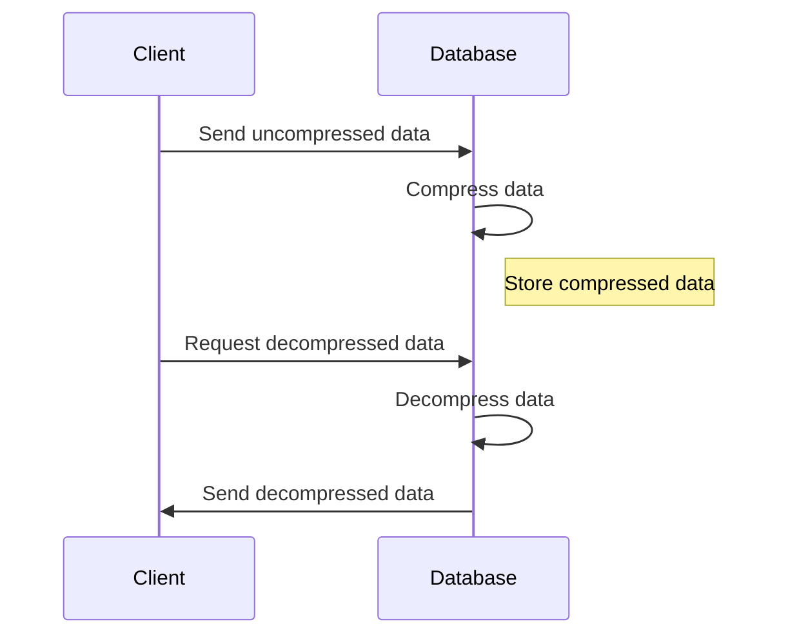

## Introduction

Data Compression is a fundamental pattern in NoSQL data modeling that focuses on reducing the storage footprint of data. It involves the application of various compression algorithms to make the storage and retrieval of large datasets more efficient, especially in environments like time-series databases where data volumes can be massive.

## Detailed Explanation

### Design Pattern Overview

Data Compression involves encoding information using fewer bits than the original representation. It's crucial for NoSQL databases handling vast amounts of data, as it plays a significant role in:

- Reducing storage costs.
- Enhancing data retrieval performance.
- Minimizing bandwidth usage during data transfers.

### Application in NoSQL

In NoSQL databases, data compression can be applied on different elements:

- **Documents**: Compressing JSON or BSON data formats.
- **Columns**: In column-family databases like Apache Cassandra.
- **Values**: Within key-value stores.

#### Example in Time-Series Databases

Time-series databases such as InfluxDB or OpenTSDB often deal with sensor data that exhibit repeating patterns over time, making them ideal candidates for compression. Lossless compression techniques like delta encoding combined with lightweight compression algorithms (e.g., Snappy, LZ4) are typically used to ensure fast and efficient data storage.

### Compression Techniques

- **Lossless Compression**: Maintains data integrity, ensuring the original data can be perfectly reconstructed from the compressed data. Key algorithms include GZIP, Snappy, and LZ4.
  
- **Lossy Compression**: Suitable for scenarios where a perfect reconstruction of data is not critical. Common in multimedia data formats due to their tolerance for minor loss in data quality.

### Choosing the Right Compression Strategy

Selecting the appropriate compression algorithm requires balancing factors such as:

- **Compression Ratio**: Degree to which data can be reduced.
- **Speed**: Time taken to compress and decompress the data.
- **Compute Resources**: CPU and memory consumption during compression.

## Example Code

Here is a basic example of using Snappy compression in Java for a NoSQL application:

```java
import org.xerial.snappy.Snappy;

public class SnappyCompressionExample {
    public static void main(String[] args) throws Exception {
        String data = "This is a sample text to demonstrate data compression.";
        
        // Compress data
        byte[] compressedData = Snappy.compress(data.getBytes("UTF-8"));
        
        // Decompress data
        byte[] uncompressedData = Snappy.uncompress(compressedData);

        System.out.println("Original Data: " + data);
        System.out.println("Decompressed Data: " + new String(uncompressedData, "UTF-8"));
    }
}
```

## Diagrams

### Sequence Diagram

Below is a Mermaid Sequence Diagram illustrating the data compression process:



## Related Patterns

- **Data Partitioning**: Distributing data to enhance performance and scalability.
- **Batch Processing**: Efficiently processing large data quantities, often used jointly with compression to handle storage efficiently.
  
## Additional Resources

- [Snappy Java Documentation](https://github.com/xerial/snappy-java)
- [Apache Cassandra Official Documentation](https://cassandra.apache.org/doc/latest/)

## Summary

The Data Compression pattern in NoSQL data modeling is integral to managing large datasets efficiently, offering a balance between storage savings and performance improvements. By effectively applying appropriate compression strategies, systems can decrease costs and improve data throughput, making them exceptionally suitable for high-scale, data-intensive applications.
