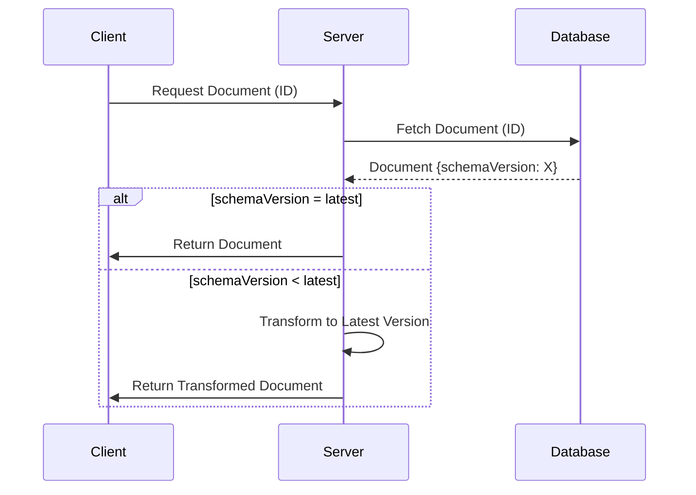

## Introduction

As systems evolve, so do the data structures they use. In NoSQL databases, managing schema evolution can be challenging due to the lack of a fixed schema. The Schema Versioning design pattern addresses this by including a version number in each document, enabling the system to interpret the data correctly across versions and handle changes in structure over time.

## Detailed Explanation

### Design Pattern Approach

Schema versioning inserts a "schemaVersion" field into each document stored in NoSQL databases. This field specifies the data structure version, enabling developers to handle various schema versions concurrently. This pattern is critical in distributed systems, where rolling updates to data formats are common, and different instances or microservices may use different schema versions.

### Example Code

Here's a basic example of how schema versioning can be implemented using JSON documents in a NoSQL datastore:

**Version 1 Document:**
```json
{
  "schemaVersion": 1,
  "firstName": "John",
  "lastName": "Doe"
}
```

**Version 2 Document:**
```json
{
  "schemaVersion": 2,
  "fullName": {
      "firstName": "John",
      "lastName": "Doe"
  },
  "email": "john.doe@example.com"
}
```

When the application reads or writes to the database, it checks the `schemaVersion` field and adapts the processing logic accordingly.

### Architectural Approaches

- **Backward Compatibility**: Ensure older versions of an application can still read newer document formats by understanding the schema version.
- **Forward Compatibility**: Allow new applications to understand older document formats by having legacy processing logic.
- **Transformation Logic**: When reading data, transform it to the latest schema version as needed.

### Best Practices

1. **Consistent Usage**: Apply schema versioning to all documents to maintain uniformity.
2. **Clear Documentation**: Maintain documentation detailing changes across versions.
3. **Automated Tests for Transformation**: Implement tests to ensure transformation logic works seamlessly across various versions.

## Diagrams

Below is a basic sequence diagram using Mermaid to illustrate how schema versioning is handled during a read operation:



## Related Patterns

- **Schema Evolution Patterns**: Comprehensive strategies for managing changes in data schemas over time, focusing on methods applied in both SQL and NoSQL databases.
- **Microservices Versioning**: Deals with how services can be versioned and updated within a microservices architecture, ensuring compatibility and communication.

## Additional Resources

- [The Basics of Schema Evolution in NoSQL Databases](https://example.com)
- [Migrating Schemas in Distributed Systems: Best Practices](https://example.com)
- [JSON Schema and Document Databases: Versioning Data Models](https://example.com)

## Summary

Schema versioning is a pivotal pattern for managing changes in data structure within NoSQL systems. By embedding version information directly into each document, systems can gracefully handle schema evolution, support backward and forward compatibility, and simplify the process of upgrading data models over time. Implementing this pattern effectively can improve maintainability and flexibility for evolving applications.

---
