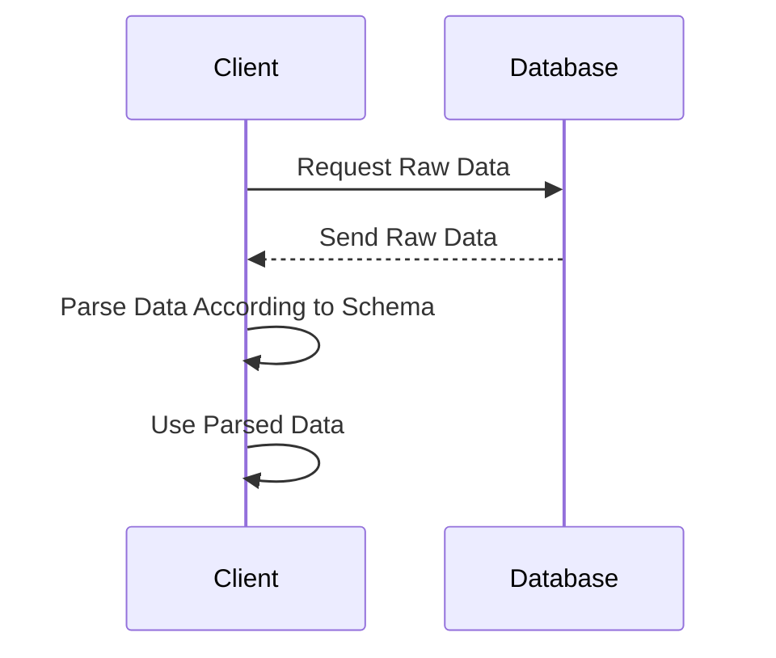

## Schema on Read Pattern

### Description

The Schema on Read pattern is a data modeling approach in which the schema of the data is applied at the time of data reading rather than at data ingestion. This strategy is particularly beneficial in environments dealing with semi-structured or unstructured data, such as NoSQL databases, data lakes, and big data platforms, where data variability is high and structuring data at the time of write might be counterproductive or limiting.

### Architectural Approach

In a Schema on Read architecture, the responsibility for data interpretation lies with the application logic during data fetch operations. This contrasts with the Schema on Write methodology, where data is strictly structured before storage, requiring a predefined schema. Schema on Read systems often store data in raw forms like JSON, XML, or plain text, which can then be reconciled to different schemas dynamically as business requirements evolve.

### Paradigms

- **Flexibility**: Schema on Read offers flexibility, allowing data formats to change over time without requiring immediate changes in data storage schema.
- **Adaptability**: Applications can adapt quickly to new types of data or changes in existing data structures, enhancing agility and reducing data-related bottlenecks.
- **Incremental Evolution**: This pattern supports the incremental extension and modification of data structures, enabling more organic data model evolution.

### Best Practices

1. **Use Versioning**: Implement version control for your data formats to manage changes over time and maintain backward compatibility.
2. **Metadata Management**: Leverage metadata frameworks to store additional context about your data that can guide dynamic schema application at read time.
3. **Schema Registries**: Utilize schema registries to maintain records of available data formats and their transformation rules.
4. **Data Quality Checks**: Incorporate tools and processes to validate data against expected structures or patterns dynamically to ensure reliability.

### Example Code

Here's a basic illustration of using Schema on Read with JSON in a JavaScript application:

```javascript
const data = fetchData(); // Assume this function fetches raw JSON data

// Schema 1: Parsing the data for User details
function parseUserData(json) {
  return {
    userId: json.id,
    fullName: `${json.firstName} ${json.lastName}`,
    email: json.contact.email,
  };
}

// Schema 2: Parsing the data for Order details
function parseOrderData(json) {
  return {
    orderId: json.orderId,
    productList: json.items.map(item => item.productName),
    totalAmount: json.items.reduce((sum, item) => sum + item.price, 0),
  };
}

// Using Schema on Read
const userInformation = parseUserData(data);
const orderInformation = parseOrderData(data);
```

### Diagrams

Here is a simple sequence diagram using Mermaid depicting how Schema on Read functions:



### Related Patterns

- **Schema on Write**: The antithesis to Schema on Read, where data is structured at the time of writing, providing strong data consistency but less flexibility.
- **Polyglot Persistence**: Using various data storage technologies, where Schema on Read can be selectively applied depending on the data nature.
- **Data Lake Pattern**: An environment that leverages Schema on Read to store and process large volumes of raw data across different formats.

### Additional Resources

- [Understanding NoSQL Data Models](https://nosql-database.org/)
- [Data Lakes in Practice](https://datalakepractice.com/)

### Summary

The Schema on Read pattern offers unparalleled flexibility and adaptability for handling diverse data structures in NoSQL databases and data lakes. While it shifts some burden to application logic, its capacity to enable dynamic data processing makes it invaluable for organizations dealing with rapidly changing data environments and varied data consumption requirements. By leveraging best practices and supporting tools, businesses can harness the full potential of this pattern to drive data-driven decision-making and innovation.
